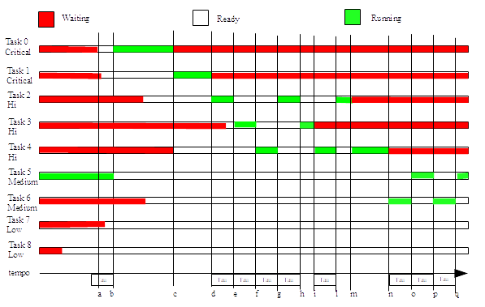
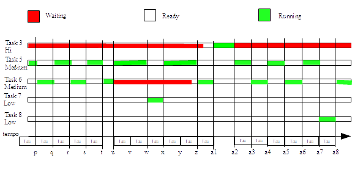

# Origins and evolution of the kernel

The RTK kernel was born as an evolution of the *Tic Object* library, originally developed for X86-family microprocessors and later for Fujitsu 16FX-family microcontrollers.

The RTK functions were later ported and consolidated on several architectures, including:

- Fujitsu 16LX
- Motorola DSC 56F80x and 56F83x (Core E)
- ARM Cortex M

This last architecture progressively replaced the previous ones in most target applications.

During this evolution, the architectural choices that did not introduce limitations tied to the specific hardware platform were kept. In particular, support for *Tic Object* was preserved, allowing the reuse of a significant part of the library code already developed over the years.

That code, having been used in many applications on different platforms, constitutes a consolidated base with a significant history of use and testing in different application contexts.

RTK is a *soft real-time* kernel intended for embedded 333applications. Its architecture is designed to be easily portable to any platform that allows a clear separation between application mode and interrupt management mode (ISR).

# Notes

RTK lives inside an operating environment that includes different libraries. Of these, the ones related to circular queue management are indispensable for its use, and their implementation is described in the appendix.

**Document version:** 3.0
**Status:** Preliminary
**Target:** embedded firmware on ARM Cortex-M
**Intended use:** technical documentation supporting development, integration, and subsequent safety analysis

---

# Purpose of the document

This document describes the RTK kernel in the current version for ARM Cortex-M.

The manual has the purpose of:

- describing the kernel architecture;
- documenting the task, scheduling, and context switch model;
- documenting wait and synchronization primitives;
- documenting the interaction with the support libraries used by the kernel;
- providing a technical base for the subsequent safety analysis and IEC 62304
  compliance analysis.

The kernel safety analysis is planned as a separate document.

---

# Scope

The document refers to the RTK version supplied in the current sources, composed mainly of the modules:

- `RTK.h`
- `Sched.h` / `Sched.c` / `SchedAsm.s`
- `RTK_Wait.h` / `RTK_Wait.c`
- `timer.h` / `Timer.c` / `TimerTic.h` / `TimerTic.c`
- `Sem.h` / `SemAsm.s`
- `CountingSem.h` / `CountingSemAsm.s`
- `MM.H` / `MM.c`
- `Tic.h` / `Tic.c`
- `TaskDiag.h` / `TaskDiag.c`
- `StkChk.h` / `StkChk.c`
- `CPP_Task.h` / `CPP_Task.cpp`
- queue libraries from `MyLib`: `GenQue`, `BinQue`, `FreeQue`, `QueByte`,
  `QueWord`, `QueDWord`.

---

# Firmware writing standard

New code and substantial changes to existing code must follow a uniform style, so that the FW is readable, verifiable, and maintainable.

The following rules do not imply immediate rewriting of historical code, but must be applied to new routines and significant interventions.

## Formatting

- Use consistent indentation inside the same file.
- The recommended indentation is one level for each logical block: functions, `if`, `else`, `switch`, `case`, loops, and conditional sections.
- The opening brace must stay on the same line as the construct that opens the block, including functions.
- Avoid very long lines; when a call or declaration is not readable on a single line, split it while aligning the parameters clearly.
- Keep distinct functional blocks separated by blank lines, without introducing excessive spacing.

Example:

```c
bool ExampleRoutine(int value){
    if(value == 0){
        return false;
    }

    return true;
}
```

## Comments

- Comments must explain the purpose, assumptions, limitations, and side effects of the code.
- Avoid comments that simply repeat the C/C++ instruction.
- Critical sections, the use of interrupts, scheduler lock, heap, timers, and shared resources must be commented when the reason is not immediate.
- Temporary comments, such as `TODO`, `FIXME`, or debug notes, must be specific and traceable.

## Routine description

Each public routine, and each non-trivial private routine, should have a short description before the definition.

The description should include only the fields significant for the routine. The fields that do not apply may be omitted or filled with `N/A`, when this makes the review clearer.

Recommended fields:

- purpose of the routine;
- input parameters;
- return value;
- preconditions;
- side effects;
- use of interrupts, scheduler lock, heap, timers, or shared resources;
- behavior in case of error;
- author;
- verifier.

Recommended schema:

```c
/*
    RoutineName

    Purpose:
        Brief description of the function.

    Parameters:
        ParamName - meaning and expected range.
        N/A if the routine has no parameters and the field is kept.

    Returns:
        Return value and error convention, or N/A.

    Preconditions:
        Conditions required before calling the routine, or N/A.

    Side effects:
        Modified global state, hardware state, timers, heap, scheduler state,
        or N/A.

    Concurrency:
        Interrupt, scheduler, or shared-resource assumptions, or N/A.

    Errors:
        Error handling policy, or N/A.

    Author:
        To be completed when required by the review process.

    Verified by:
        To be completed when required by the review process.
*/
```

The `Author` and `Verified by` fields may be left unfilled in historical code. For new or validated code they must be completed when the review process requires it.

---

# Terminology

| Term | Meaning |
|---|---|
| Task | Unit of execution managed by the RTK scheduler. |
| Task descriptor | `T_TaskDescriptor` structure containing CPU context, state, priority, timer, and task diagnostics. |
| PSP | ARM Cortex-M Process Stack Pointer, used as the stack pointer of tasks. |
| MSP | ARM Cortex-M Main Stack Pointer, used by the system and interrupts. |
| PendSV | ARM Cortex-M exception used for context switch. |
| SysTick | ARM Cortex-M periodic timer used as the system tick. |
| Persistent timeout | Mechanism by which the task timer may be kept across several successive waits. |
| Tic Object | Lightweight periodic function executed by the tick at every tic, using MSP. |
| Sched Object | Lightweight periodic function executed by the tick every N tics, with N decided at compile time, using MSP. |

---

# General architecture

RTK is a soft real-time kernel for embedded systems, conceived to be simple and essential enough to be understood in detail by the user. In partial contrast to the more common approach, this mode makes it possible to consider it more as an integral part of the application FW than as an environment inside which the application is executed, with full awareness of its strengths and limitations.
For this reason RTK may be used either as a standalone library, compiled separately, or as a set of sources to be compiled together with the application itself.

The architecture is composed of the following subsystems:

1. **Task management**: creation, destruction, and management of tasks;
2. **Scheduler**: selects the task to execute based on priority, state, and wait conditions.
3. **System Tic**: invokes time-based scheduling.
4. **ARM Cortex-M context switch**: performs the switch between the running task and the next one.
5. **Wait subsystem**: implements suspensions on time, semaphores, queues, flags, bits, masks, and other objects.
6. **Timer subsystem**: manages timers ordered by expiration and the related diagnostics.
7. **Heap manager**: provides dynamic allocation (`malloc`, `free`, etc.) and the related diagnostics.
8. **Tic and Sched Object subsystem**: optional, for lightweight periodic functions.
9. **Runtime diagnostics**: task status, stack check, heap check, timer check, and local LastError.

RTK provides several pointers to tasks, which may be organized as linked lists.

The pointers are:

```c
volatile T_TaskDescriptor *IdleTaskDescriptor;
volatile T_TaskDescriptor *CriticalProcList;
volatile T_TaskDescriptor *HiPriProcList;
volatile T_TaskDescriptor *MediumPriProcList;
volatile T_TaskDescriptor *LowPriProcList;
volatile T_TaskDescriptor *BkGroundProcList;
volatile T_TaskDescriptor *CurrentTaskPtr;
T_TaskDescriptor ExitTask;
```

and, in order, they contain:

- The pointer to the Idle task;
- The pointer to the list of tasks with "critical" priority;
- ...
- The pointer to the list of tasks with Background priority;
- The pointer to the task currently running;
- The pointer to a fictitious task that allows execution of main to restart from
  the instruction immediately following the call to SchedulerStart.

---

# System initialization

RTK must be initialized and started inside main, after initializing the heap manager. Before it can be started, moreover, it is indispensable to have created at least one task, otherwise the scheduler will exit immediately returning control to main.

The typical sequence is therefore the following:

```c
extern "C" void IdleTask(){
    .....
}

extern "C" void MainTask(){
    .....
}

T_TaskDescriptor *MainTaskDescriptor;

#define TIC_PER_TAU_RATIO      10
#define MEDIUM_FOR_LOW_RATIO   5
#define MAX_SCHED_ROUTINES     20
#define MAX_ISR_ROUTINES       10
#define MAIN_TASK_STACK_WORDS  4500

int main(){
    HW_Init();      // Hardware initialize
	minit();		// Heap init
	SchedulerInit(IdleTask,
	              TIC_PER_TAU_RATIO,
	              MEDIUM_FOR_LOW_RATIO,
	              MAX_SCHED_ROUTINES,
	              MAX_ISR_ROUTINES);
	MainTaskDescriptor=CreateNamedTask(MainTask, RTK_Pack("Main task   "), MAIN_TASK_STACK_WORDS, TaskPriorityMedium);
	if(!SchedulerStart())
		return 1;
	return 0;
}
```

In this example the scheduler is initialized by specifying:

- The idle task, which is executed whenever there are no other ready-to-run tasks;
- The Tau period expressed in tics (10 one-millisecond tics in our example); 
- the execution ratio between medium-priority tasks and low-priority tasks (5:1 in the example);
- The maximum number of sched routines that may be hooked to the tic, which also determines their execution period (20 in our example, which implies that the execution cadence, for each of them, is 20 ms);
- the maximum number of tic routines that may be hooked to the tic (10 in the example).

Once this has been done, at least one task (MainTask in our case) is hooked, to which a stack space of `MAIN_TASK_STACK_WORDS` WORD[^StackDimension] is assigned, with medium priority and a label. The label is compressed by means of the RTK_Pack macro, which encodes some characters (3, 6, or 12) in an integer variable of type WORD, DWORD, or QWORD according to the value of the TASK_LABEL
define.

[^StackDimension]: The size is expressed in 16-bit WORDs as a legacy of the Motorola DSC port, where memory was addressable only by WORD.

Finally, control is passed to RTK through the call to SchedulerStart. The function returns `false` if the scheduler has not been initialized; otherwise it starts RTK and returns `true` when all non-idle tasks have been destroyed.

### API

```c
bool SchedulerInit(Func IdleTask, BYTE ParTicPerTau, BYTE ParMediumForLow
	#ifdef TIC_OBJs
		,WORD MaxSchedRoutines, WORD MaxISR_Routines
	 #endif
);

bool SchedulerStart(void);

#if TASK_LABEL == 16
	typedef WORD T_Text;
	#define RTK_Pack Pack16
#elif TASK_LABEL == 32
	typedef DWORD T_Text;
	#define RTK_Pack Pack32
#elif TASK_LABEL == 64
	typedef QWORD T_Text;
	#define RTK_Pack Pack64
#endif

```

##### SchedulerInit

```c
bool SchedulerInit(Func IdleTask, BYTE ParTicPerTau, BYTE ParMediumForLow
	#ifdef TIC_OBJs
		,WORD MaxSchedRoutines, WORD MaxISR_Routines
	 #endif
);
```

This function initializes the persistent scheduler configuration and must be called with the system stopped. After a successfully completed `SchedulerInit()` it is possible to execute one or more `SchedulerStart()` cycles. Before each cycle at least one of the user tasks that must be executed in that cycle must be created.

- Stores the related passed values in the global variables **TicPerTau** and **MediumForLow**;
- Stores the pointer to the idle function, which will be used by `SchedulerStart()`;
- Clears `IdleTaskDescriptor`, which must be `NULL` when the scheduler is not running;
- Initializes **FirstToTic**, which points to the timer list, to `NULL` by calling `InitTimerTic()`;
- Sets all the other task pointers to NULL;
- If tic objects are expected to be used, stores the `MaxSchedRoutines` and `MaxISR_Routines` limits;
- Clears the optional scheduling diagnostic counters.

##### SchedulerStart

```c
bool SchedulerStart(void);
```

This function prepares the scheduler runtime state, creates the idle task, starts the system tic, and passes control to RTK tasks. Runtime initializations are repeated at each call, so as to allow one or more `SchedulerStart()` cycles after a single `SchedulerInit()`.

- Verifies that the idle function has been set by `SchedulerInit()` and that `IdleTaskDescriptor` is `NULL`;
- Allocates the space for the idle task, reserving `IDLE_TASK_STACK_SIZE` WORDs for its stack;
- Prepares the context of the idle task so that it can be executed when needed;
- If evaluation of free stack is enabled, initializes the stack with the expected pattern;
- If labels, execution counters, or idle time are enabled, initializes the related fields of the idle task;
- If tic objects are enabled, calls `InitTicObjects()` using the limits saved by `SchedulerInit()`;
- Reinitializes the timer list by calling `InitTimerTic()`;
- Sets the priority of PENDVS;
- Sets the priority of systic;
- Activates the system tic;
- Copies the pointer of ExitTask to CurrentTaskPtr. This will cause, at the first scheduling interrupt, the execution context of SchedulerStart to be saved on ExitTask, the task that will be invoked to terminate the scheduler; 
- Initializes the TauCtr counter, used to determine priority inversion between medium- and low-priority tasks, to the TicPerTau value; 
- Reinitializes `PriorityInversionCtr`, `DeleteCurrentTask`, and the optional diagnostic counters;
- Marks the kernel as running and enables interrupts;
- Forces scheduling.

The function has a practical effect only if at least one user task has already b een created. If there are no executable user tasks, or when all user tasks have been destroyed, the scheduler selects `ExitTask` and control returns to the caller of `SchedulerStart()`.

When the scheduler determines that there are no more tasks in the various lists, control returns to this function, which, in order:

- Disables interrupts;
- Deactivates Systic;
- restores the priority of systic and PENDVS;
- marks the kernel as not running;
- if configured, deinitializes the tic objects;
- destroys the idle task and clears `IdleTaskDescriptor`;
- restores any floating point context of the caller;
- returns to the caller (typically main).

The return value is `false` if the start preconditions are missing or if a runtime allocation/initialization fails; it is `true` after a regular scheduler start and return. After a regular return it is possible to create new user tasks and call `SchedulerStart()` again even without repeating `SchedulerInit()`.

### Calling `SCHEDULE` from interrupt

An application interrupt may request scheduling by activating `PendSV` through the `SCHEDULE` macro, but only while the kernel is running, that is, after the actual start of `SchedulerStart()` and before the return from that function. Calling `SCHEDULE` when the kernel is not running, for example at reset, before `SchedulerInit()`/`SchedulerStart()` or after scheduler termination, makes the
context used by `PendSV_Handler` invalid and may lead to faults or RTK state corruption. ISRs that may be active also outside the kernel execution window must therefore check `KernelRunning` before invoking `SCHEDULE`.

---

# Task management

A task is essentially a function that is executed in a virtually concurrent way with the others. For this to be possible, each task has its own structure of type **T_TaskDescriptor**, which contains the complete description of its state (context).

## Task descriptor

Each RTK task is represented by a `T_TaskDescriptor` structure, defined in `Sched.h`.

The task descriptor contains:

- the CPU context saved by the kernel;
- the link to the task list;
- The state of the task, which includes:
  - The type of object for which it is waiting;
  - The pointer to the object for which the task is waiting;
  - the timer used for timed suspensions and timeouts;
  - the wait-condition parameters;
- the priority;
- any optional diagnostic fields.

```c
struct S_TaskDescriptor{
    T_RegisterFile *PSP;
    DWORD R4;
    DWORD R5;
    DWORD R6;
    DWORD R7;
    DWORD R8;
    DWORD R9;
    DWORD R10;
    DWORD R11;
    DWORD R14;
    float S16_31[16];

    struct S_TaskDescriptor *Next;

    union{
        TQueHeader *Q;
        TBinaryLenQueHeader *BQ;
        TFreeLenQueHeader *FQ;
        volatile BYTE *C;
        volatile WORD *W;
        volatile DWORD *DW;
        volatile Semaphore *S;
        volatile T_CountingSem *CS;
        volatile Flag *F;
        /* T_CanQue *CQ; */
    }ObjectToWait;

    T_Timer Time;

    union {
        DWORD DW_Param;
        WORD W_Param;
        BYTE B_Param;
    }Param;

    volatile union {
        T_TaskStatus AsBit;
        BYTE AsByte;
    }TaskStatus;

    BYTE TaskPriority;

#ifdef EXECUTION_CTR
    WORD TaskCtr;
#endif

#ifdef TASK_LABEL
    T_Text Label;
#endif

#ifdef LOCAL_LAST_ERROR
    WORD LocalLastError;
#endif

#ifdef IDLE_TIME
    DWORD TimerCtrAtLastSched;
#endif

#ifdef CALLER_ADDRESS
    void *WaitCallerAddress;
#endif
};

typedef struct S_TaskDescriptor T_TaskDescriptor;
```

Analyzing the fields of the structure one by one, we find:

### CPU context

In the ARM Cortex-M port, part of the context is automatically saved in the process stack by the hardware when entering an ISR.

This part is represented by the structure of type T_RegisterFile, pointed to by the PSP field, which is written in the PENDSV ISR. That ISR takes this address from the processor PSP register and copies it into the task descriptor.

The structure of T_RegisterFile is the following:

```c
typedef struct T_RegisterFile{
	DWORD R0;
	DWORD R1;
	DWORD R2;
	DWORD R3;
	DWORD R12;
	DWORD LR;
	DWORD PC;
	union{
		DWORD xPSR;
		struct{
			DWORD ExceptionNumber: 9;
			DWORD res: 1;
			DWORD ICI_IT: 6;
			DWORD res1: 8;
			DWORD Tumb: 1;       // Must be 1;
			DWORD ICI_IT1: 2;
			DWORD Q: 1;
			DWORD V: 1;
			WORD C: 1;
			DWORD Z: 1;
			DWORD N: 1;
		};
	};
	float S0_15[16];
	DWORD FPSCR;
	DWORD	Aligner;
}T_RegisterFile;
```

This is followed by the nine 32-bit registers and the sixteen float registers that are not saved automatically on entry to PENDSV and that are therefore copied by the context switching routine.

### Link pointer

Then we find

```c
struct S_TaskDescriptor *Next;
```

which contains the link to the next task descriptor in the linked list of the current priority.

### Task priorities

Tasks may have different priority.

The priorities are defined by `T_TaskPriority`:

```c
typedef enum T_TaskPriority{
    TaskPriorityCritical=0,
    TaskPriorityHi,
    TaskPriorityMedium,
    TaskPriorityLow,
    TaskPriorityBackGround,
    TaskPriorityIdle,
    InvalidTaskPriority=0xFF
} T_TaskPriority;
```

### Task state

The task state (suspension conditions and other information) will be described in detail later.

### TaskCtr

Optional counter, present only if the EXECUTION_CTR macro is defined, which is incremented every time the task is scheduled.

### Label

Optional variable, present only if the TASK_LABEL macro of type T_Text is defined, which contains the textual label used to identify the task during debug. The T_Text type defines the space occupied by the label which, in the ARM implementation, is normally 64 bits and, with a 3-out-of-16 encoding in DECT style, allows storing 12 alphabetic characters.

### LocalLastError

Optional variable, present only if the LOCAL_LAST_ERROR macro is defined, which allows storing the "last error" related to the running task.

### TimerCtrAtLastSched

Variable present only if the IDLE_TIME macro is defined, on which the value of the system timer at the instant of the last task scheduling is stored. It makes it possible to know how long the task has been in the inactive state.

## WaitCallerAddress

Pointer, present only if the CALLER_ADDRESS macro is defined, used by the suspension functions to store the address from which the function was invoked. This value allows runtime diagnostics to identify and display the call site that placed the task in its current WaitingFor state.

## Task management functions

Tasks may be created, destroyed, put in wait, changed in priority, and so on.

##### CreateTask

```c
T_TaskDescriptor *CreateTask(Func Task, WORD StkSize, T_TaskPriority Priority);
```

Creates a task without parameters.

##### CreateNamedTask

```c
T_TaskDescriptor *CreateNamedTask(Func Task, T_Text Label, WORD StkSize, T_TaskPriority Priority);
```

Creates a task and associates a diagnostic label with it. The label is encoded on 16, 32, or 64 bits in 3-out-of-16 encoding; the size of `T_Text` depends on the `TASK_LABEL` macro:

```c
#if TASK_LABEL == 16
    typedef WORD T_Text;
#elif TASK_LABEL == 32
    typedef DWORD T_Text;
#elif TASK_LABEL == 64
    typedef QWORD T_Text;
#endif
```

In the supplied configuration `TASK_LABEL` is `64`, which indicates that the variable may contain a 12-character string.

##### CreateParTask

```c
T_TaskDescriptor *CreateParTask(FuncPar Task, DWORD TaskParam, WORD StkSize, T_TaskPriority Priority);
```

Creates a task by passing a `DWORD` parameter in `R0`.

##### CreateNamedParTask

```c
T_TaskDescriptor *CreateNamedParTask(FuncPar Task, DWORD TaskParam, T_Text Label, WORD StkSize, T_TaskPriority Priority);
```

Creates a parameterized task with diagnostic label.

##### Terminate

```c
void Terminate(void);
```

Function that may be invoked during execution of a task by the task itself to self-terminate. It terminates the task currently running and deallocates its context.

Before requesting PendSV, `Terminate()` re-enables the scheduling path masked through `BASEPRI`. In this way a task that terminates while PendSV is still masked by `RTK_SchedulerLock()` does not leave the context switch blocked. The function does not restore `PRIMASK`: a task must not terminate while it keeps a `START_PROTECTION` section open.

##### KillTask

```c
void KillTask(T_TaskDescriptor *TaskToDelete);
```

Function that may be invoked by any task different from the task currently running to terminate a task.

**Note:** it must not be used to terminate the current task; for that case `Terminate()` is used.

The caller shall pass a task descriptor that is still valid for the current scheduler instance. A future firmware review shall evaluate whether this API should actively verify that the descriptor still belongs to a scheduler task list before operating on it. Such a check would improve robustness against stale or corrupted handles, but it may introduce execution-time, code-size, locking,
or list-scanning costs.

##### ChangeTaskPriority

```c
bool ChangeTaskPriority(T_TaskDescriptor *Task, T_TaskPriority NewPriority);
```

Function that modifies the priority of a task. It returns `false` if the task pointer is not valid.

As for `KillTask()`, the caller shall pass a task descriptor that is still valid for the current scheduler instance. A future firmware review shall evaluate whether list-membership validation is justified for this API, balancing the robustness benefit against the runtime and implementation cost.

## C++ task

The `CPP_Task` module allows modeling a task as a C++ object derived from the virtual class `T_CPP_Task`.

```cpp
class T_CPP_Task{
public:
    T_CPP_Task(void);
    virtual ~T_CPP_Task();
    bool Run(const char *Nome, short StackSize, T_TaskPriority TaskPriority);
    virtual void Task(void)=0;
    void SetTaskName(const char *Nome);
    T_TaskDescriptor *Handle;
};
```

`Run()` method creates the RTK task descriptor and starts execution through the static "C" wrapper function `CPP_TaskExec()`. 

`CPP_TaskExec()` is invoked with a pointer to a `T_CPP_Task` object and calls its virtual `Task()` method.

When `Task()` returns the wrapper clears `Handle` and deletes the C++ object.

The preferred termination model is cooperative: the owner requests termination through an application flag, the task observes the flag, releases its resources, and returns from `Task()`. Object destruction is then completed by `CPP_TaskExec()`.

If a `T_CPP_Task` object is destroyed while `Handle` is still valid, the base destructor calls `KillTask()` to stop the associated RTK task. This is a forced termination path and should be reserved for exceptional cleanup cases, because the task does not get a normal return path from `Task()`.

---

# Scheduler

The scheduling routine, invoked by the context switch, takes care of determining which task, among those ready to run, must be executed. The choice is made based on priority, guaranteeing the best responsiveness for higher-priority tasks and a sharing of the remaining time among lower-priority ones.

The scheduling operation, having to scan the tasks in priority order to determine which is the next to execute, involves a certain time overhead and, consequently, executing it at a high cadence may degrade global performance. However it is necessary, to guarantee system responsiveness, that the cadence is not too low and, to satisfy these two opposite needs, when the scheduler is invoked the global variable **SchedulazioneCompleta** indicates whether scheduling must occur only among the higher-priority tasks, that is, those that require greater responsiveness, or among all tasks, so as to guarantee scheduling also among the lower-priority tasks.

## Wait-condition evaluation

During task scanning, the scheduler analyzes the `TaskStatus` field to determine whether a suspended task may be considered executable.

The scan occurs in priority order and stops as soon as the first executable task is found.

For each examined task:

1. the wait type (`T_WaitingType`) is read;
2. `ObjectToWait` is retrieved;
3. the associated condition is evaluated;
4. if the condition is true:
   - the task is considered executable and the scan ends;
5. if the condition is not true:
   - if a timeout is present and the timer has expired, the task is nevertheless considered executable and the scan ends;
   - otherwise the task is not executable and the scheduler moves to the next one.

The scheduler returns to the caller the first task found executable, which is then placed in execution.

The term *ready to run* does not indicate a state stored in the task descriptor, but the result of the evaluation performed by the  scheduler.

The evaluation of the condition depends on the wait type.

The primitives of the `WaitFor...` family delegate the evaluation of the condition completely to the scheduler.

The primitives of the `CheckAndWaitFor...` family instead perform a  preliminary check of the condition: if it is already satisfied, the task does not enter the wait state and a new scheduling is not forced.

## Scheduling policy

The scheduler is implemented by means of the FirstToRun function, which returns the pointer to the next task to execute. FirstToRun uses, for the choice, the pointer to the task currently running, `CurrentTaskPtr`, the boolean variable **SchedulazioneCompleta**, and, obviously, the pointers to the lists that contain the active tasks of each priority, the pointer to the Idle task, and the pointer to the termination task.

The choice is made by scanning the lists in priority order, starting from the highest-priority one, considering that the priority between Medium and Low is inverted every **MediumForLow** schedulings of Medium-priority tasks, where **MediumForLow** is a parameter settable when starting the scheduler.

If **SchedulazioneCompleta** is false and **CurrentTaskPtr** is different from **IdleTaskDescriptor**, scheduling is performed only on the first two lists (Critical and Hi); otherwise the scan continues until a task ready for execution is found. If no executable task is found but at least one of the lists is not empty, the function returns **IdleTaskDescriptor**; otherwise it returns the pointer to **ExitTask**.

When, inside the list of tasks of a given priority, the task to execute is
identified, the pointer to the list is updated to the task pointed to by the `Next` field of the selected task. In this way, at subsequent schedulings, the scan resumes from the following task, implementing a cyclic rotation (round-robin) among tasks of the same priority.

## Scheduling example

In the following figure, for explanatory purposes, the time behavior of the execution of some tasks appears. In the first figure we have a critical-priority task (task 0) that becomes ready (a). At the first scheduling (b), consequently, it is put in execution and is not interrupted, although there are other ready tasks, one of which (1) is critical priority, until the task spontaneously puts itself in wait. At this point task 1, which is also critical priority, is scheduled and becomes running (c). For this reason the task is not interrupted until it spontaneously becomes waiting (d). At this point task 2, with Hi priority, is put in execution and runs for Tau until (e), where it is replaced by task 3, which at (f) is replaced by 4, which at (g) is again replaced by 2, and so on until at (i) and (m) two of the three HI-priority tasks exhaust their functions and become Waiting. At this point the remaining task, since there are no other ready tasks of equal or higher priority, runs uninterrupted until (n), where it exhausts its functions and becomes waiting. Subsequently, since there are no more critical- or high-priority ready tasks, medium- and low-priority tasks run (n, o, p, q). Their way of dividing CPU time is clarified better by the following figure.

{#fig:Scheduling1 width=100%}

In this figure, in fact, we see that in the absence of higher-priority ready tasks, time is divided among medium-priority tasks, which run alternately for a predetermined number N of system time periods, and low-priority tasks which, cyclically, are put in execution once every N medium executions (w) and (a7). If, during execution of these tasks, a higher-priority task becomes ready (a1), it obviously interrupts their scheduling.

{#fig:Scheduling2 width=100%}

In the previous charts there are no background-priority tasks, which would in any case run only if there were no ready tasks of higher priority.

---

# System Tic

The basic time unit, also called **Time quantum** or **Tic**, used by RTK is generated by a timed interrupt (**SysTic** in the ARM architecture). This interrupt typically has a periodicity of 1 ms, suitable for executing operations for which high responsiveness is required but less suitable for scheduling low-priority tasks. For this reason a divider is introduced to determine, in addition to the **Tic** period, a **Tau** period used for operations that are less demanding in time terms. The ratio between the Tic period and the Tau period is determined by the **TicPerTau** parameter settable when starting the scheduler.

At every time quantum, scheduling is requested through PendSV. If the context switch is not temporarily masked and a  Critical-priority task is not running, the Critical and Hi priority task lists are scanned in order to search for the first ready task. The temporary scheduler block occurs by masking PendSV through `BASEPRI`, using the `RTK_SchedulerLock()` and `RTK_SchedulerUnlock()` primitives.

At Tau cadence, instead, that is, every TicPerTau quanta, all lists are scanned in priority order in search of the first ready task which, if different from the one currently running, is scheduled. The counter used to generate the system quantum is reloaded every time a task of Medium priority or lower is put in execution, so as to guarantee that tasks of that priority do not run uninterrupted for a time greater than Tau if there are other tasks of higher or equal priority, but still lower than Hi, ready to be put in execution.

## Tic Object

By Tic Object is meant a series of passing (non-blocking) functions that are executed periodically inside the context of the system tic. These functions, in addition to being non-blocking, must occupy, in their totality, a time short enough not to constitute a limitation for the responsiveness requirements of RTK within the system being built. This consideration, charged to the system designer, implies evaluating both that the total time, even in the worst case, must not exceed the configured tic period, and that servicing the tic objects extends the service time of the system interrupt and that, during this time, the scheduler cannot be executed. This implies, if an interrupt linked to an asynchronous event invokes scheduling, a delay in its execution.

The Tic Object module is compiled if `TIC_OBJs` is defined in `RTK_Config.h`.

### Organization of the routines.

The pointers to the Tic and Sched tic routines are contained in two vectors (ISR and Sched) of predetermined size during initialization. Two vectors with the same number of elements (ISR_HndIndex and SchedHndIndex) contain the handlers corresponding to the functions inserted in ISR and Sched. The handlers are not necessarily ordered because the functions that insert or remove the routines from the vectors always keep them compacted to optimize tic execution time. The variables NumOfISR and NumOfSched determine the number of functions inserted in the vectors, while MaxISR and MaxSched are the sizes of the vectors themselves.

Memory creation for the vectors and their initialization is delegated to the InitTicObjects function, which is invoked by RTK.

Destruction of the vectors is delegated to the DeinitTicObjects function, which is invoked by RTK.

Cyclic execution of the routines is delegated to the TicObjectProcess function, which is invoked inside the systic ISR managed by RTK.

### Tic routines and sched routines

The module distinguishes two classes of passing periodic functions:

- Tic Routines: routines that, when hooked to the tic, are all executed at every system tic, independently of their number;
- Sched Routines: routines that, when hooked to the tic, are executed in rotation, only one at each tic.

Both (Tic and Sched routines) are executed inside the context of the system tic, and this imposes limitations:

- Tic and Sched routines must be non-blocking;
- Tic and Sched routines must be "short", that is, in their total they cannot take more time than the system tic or more than the maximum admissible delay between the call to Schedule and the actual scheduling of the next task to execute.

Both of these evaluations are charged to the system designer.

- If CONSTANT_SCHEDULING_TIME is equal to 1, each sched routine, independently of the number of hooked sched routines, is executed only once every MaxSched tics;
- if instead it is defined as 0, each sched routine is executed only once every NumOfSched tics.

### Notes on list initialization

If `TIC_OBJs` is enabled, `SchedulerInit()` receives two additional parameters, MaxSchedRoutines and MaxISR_Routines, which are used to size the tic object lists.

`InitTicObjects(MaxSchedRoutines, MaxISR_Routines)` allocates a single memory block for:

- pointers to tic routines (`ISR`);
- pointers to sched routines (`Sched`);
- indices of tic routine handles (`ISR_HndIndex`);
- indices of sched routine handles (`SchedHndIndex`).

The handles of tic routines are in the range:

```c
1 ... MaxISR
```

The handles of sched routines are in the range:

```c
MaxISR + 1 ... MaxISR + MaxSched
```

`Sgancia(HANDLE Hnd)` uses the handle value to automatically select the correct list.

##### AgganciaTic

```c
HANDLE AgganciaTic(Func F);
```

Inserts `F` in the `ISR` list. If insertion succeeds it returns a valid handle; if there is no space it returns `INVALID_HANDLE`.

When the first tic routine is hooked, the handle table is initialized with progressive values starting from 1.

At each call to `TicObjectProcess()` all tic routines present in the list are executed in sequence:

```c
for(WORD i = 0; i < NumOfISR; i++)
    ISR->Ptr[i]();
```

##### AgganciaSched

```c
HANDLE AgganciaSched(Func F);
```

Inserts `F` in the `Sched` list. If insertion succeeds it returns a valid handle; if there is no space it returns `INVALID_HANDLE`.

When the first sched routine is hooked, the handle table is initialized with progressive values starting from `MaxISR + 1`.

The sched routines are executed one at a time, in rotation, by `TicObjectProcess()`. The `CntSched` counter identifies the next routine to call.

The `CONSTANT_SCHEDULING_TIME` define makes it possible to determine the behavior of sched objects:

- when it is defined as 0, the sched routines are called in turn, one at each system tic, and the execution period of sched routines is therefore given by NumOfSched;
- when defined as 1, the counter cycles up to `MaxSched`, not up to `NumOfSched`. This mode makes the time profile of the system more constant (and known a priori) when sched routines are hooked or unhooked at runtime.

```c
  #if CONSTANT_SCHEDULING_TIME
   if(CntSched++>=MaxSched)
    CntSched=0;
   if(CntSched<NumOfSched)
    Sched->Ptr[CntSched]();
  #else
   if(NumOfSched){
    if(++CntSched>=NumOfSched)
     CntSched=0;
    Sched->Ptr[CntSched]();
   }
  #endif
```

##### Sgancia

```c
void Sgancia(HANDLE Hnd);
```

Removes a tic routine or a sched routine based on the handle range:

- `Hnd <= MaxISR`: removal from the `ISR` list;
- `MaxISR < Hnd <= MaxISR + MaxSched`: removal from the `Sched` list;
- other values: invalid handle.

The internal functions `SganciaTic()` and `SganciaSched()` compact the list by moving the following elements and reinsert the freed handle at the end of the handle table. The list modification section is protected through `START_PROTECTION` / `END_PROTECTION`.

### Execution in the system tick

In `SysTick_Handler()` the kernel executes, in order:

1. increment of the HAL/ST tick (`uwTick++`);
2. timer management (`TimerTic()`);
3. if enabled, Tic Object processing (`TicObjectProcess()`);
4. diagnostic counters and scheduling logic.

Consequently, tic routines and sched routines must have short and deterministic duration, because they are executed before the scheduling part of the tick.

### Operational limitations

Functions hooked as Tic Object or sched routines must not:

- call `WaitFor...` primitives;
- use blocking functions;
- use dynamic heap in an uncontrolled way;
- execute long or non-deterministic operations;
- assume they are executed in the context of a specific task.

---

# Context switch

The context switch, implemented in assembly in the SchedAsm.s module, is performed inside the PendSV interrupt, which is invoked either by the system tic or by an explicit request from the FW, for example from an ISR that sets a flag making a dormant task *Ready to run* and therefore forces scheduling to cause its immediate execution at the end of the ISR. PendSV is an interrupt expressly intended for this purpose and, to prevent it from being executed inside an ISR, must have a priority lower than all other interrupts.

ARM processors have two distinct stack pointers, **MSP** and **PSP**, also called **USP**. MSP (main stack pointer) is used as the default stack pointer for systems that do not implement context switch and as the stack pointer dedicated to ISRs in systems that implement it. In this case some architectures (not this one in particular) may also use MSP for some system functions. PSP (process stack pointer, or also user stack pointer), in systems that allow context switching, is used as the pointer to the process stack, which in our case corresponds to the stack of the running task.

On entry to the PendSV ISR, ARM hardware directly saves some registers in the current stack (user stack, since PendSV cannot interrupt other ISRs) and switches the active stack from the user stack, PSP, to the system stack, MSP. At this point the routine saves the remaining registers (including PSP) in the appropriate area provided in the task descriptor of the task that was interrupted, pointed to by **CurrentTaskPtr**, invokes the scheduling routine **FirstToRun**, which returns the pointer to the next task to execute, and performs the reverse process to the entry process, retrieving from its task descriptor the registers that will not be restored automatically on exit from the ISR.

This context switch routine differs slightly from the one normally used on ARM Cortex because the registers that are not saved automatically by the ISR are not saved in PSP but in a fixed-address area inside the task descriptor.

```c
/*               PendSV_Handler
    At this point, registers R0, R1, R2, R3, R12, LR, PC, and xPSR have already been automatically
    saved on the process stack (PSP) by the hardware upon exception entry.

    The stack in use during the ISR is the Main Stack Pointer (MSP).

    The current value of LR does not represent a return address, but contains a special EXC_RETURN
    code that encodes the processor state at the time the exception was taken.

    The handler stores into the current task descriptor the registers that are not automatically
    saved by the hardware. Among these, the PSP (Process Stack Pointer) is first read into R3
    and then saved along with the other registers.

    NOTE: Bit 4 of EXC_RETURN (LR) indicates whether a floating-point context is present.
    If this bit is 0, the floating-point state is active and the additional registers S16-S31 must
    be saved/restored by software. If it is 1, no floating-point context is involved, and these
    registers do not need to be preserved.
*/
PendSV_Handler:
	LDR	R0,= CurrentTaskPtr
	LDR	R1,[R0]
	MRS	R3,PSP
 	ISB
	STM	R1!,{R3-R11, LR}

    // NOTE: Check whether this can be modified to perform the save operation only
    // when an actual context switch is required, in order to avoid unnecessary
    // overhead for high-priority tasks that are typically executed repeatedly
    // without being preempted by another task.

	TST	LR,#0x10
	IT	EQ
	VSTMIAEQ 	R1!,{S16-S31}
	BL	FirstToRun	// Select the next task to run

    // At this point, R0 points to the task descriptor of the task to be executed.
    // The registers that are not automatically saved by the hardware on exception
    // entry are restored from the task descriptor. In particular, the PSP (Process
    // Stack Pointer) is loaded into R3, after which the handler returns from the
    // interrupt.
	LDM	R0!,{R3-R11, LR}

	TST     LR, #0x10
	IT      EQ
	VLDMIAEQ	R0!,{S16-S31}

	MSR     PSP, R3
	ISB

	BX	LR      // RETI  (LR=R14=return address)
    // N.B. When returning with BX LR, LR must contain a special EXC_RETURN value
    // of the form 0xFFFFFFxx.
    //
    // This value is not a normal return address. It tells the processor how to
    // return from the exception: whether an FP context must be popped, whether to
    // return to Thread mode, and whether to use PSP or MSP.
    //
    // The actual return address is then restored from the exception stack frame,
    // taken from the stack selected by the EXC_RETURN value.
```

---

# Wait subsystem

The wait subsystem is the RTK subsystem that allows a task to suspend itself voluntarily while waiting for a condition. Suspension always occurs at task level: a task that invokes a wait primitive modifies its own state in the task descriptor and forces new scheduling, allowing the scheduler to execute another ready task.

From a logical point of view, a task may be in one of the following states:

- running;
- ready to be executed;
- waiting for a condition;
- waiting for a condition with timeout.

The transition between states is managed exclusively by the kernel.

## Structure of the wait condition

The wait condition is described inside the task descriptor through the following fields:

- `TaskStatus`: contains the wait type (`T_WaitingType`);
- `ObjectToWait`: pointer to the object on which the task is suspended;
- `Param`: accessory parameter (bit, mask, value, etc.);
- `Time`: timer associated with the task.

    union{
        TQueHeader *Q;
        TBinaryLenQueHeader *BQ;
        TFreeLenQueHeader *FQ;
        volatile BYTE *C;
        volatile WORD *W;
        volatile DWORD *DW;
        volatile Semaphore *S;
        volatile T_CountingSem *CS;
        volatile Flag *F;
    }ObjectToWait;

    T_Timer Time;

    union {
        DWORD DW_Param;
        WORD W_Param;
        BYTE B_Param;
    }Param;

    volatile union {
        T_TaskStatus AsBit;
        BYTE AsByte;
    }TaskStatus;

The actual type of the object contained in `ObjectToWait` is determined by the value of `TaskStatus`.

## Notes on concurrency

The objects used in wait conditions (queues, flags, semaphores) are designed to be used in concurrent contexts according to specific access rules.

In particular:

- Circular queues support concurrent access **without explicit protection**
  provided that the constraint is respected of:
  - a single producer;
  - a single consumer.

  In this model:
  - the producer writes the data and subsequently updates the input pointer;
  - the consumer reads the data and subsequently updates the output pointer.

  This guarantees consistency without the need for semaphores or critical sections.

- The flags and variables used for waits on bits or masks must be accessible atomically with respect to the size of the type (BYTE, WORD, DWORD), as guaranteed by the target architecture.

- Semaphores (binary or counting) explicitly provide a synchronization mechanism between tasks or between task and ISR.

The kernel does not introduce further automatic synchronization mechanisms on wait conditions: the correctness of concurrent behavior depends on respecting the rules of use provided for each object.

## Suspension sequence

When a task invokes a wait primitive, the kernel executes the following sequence:

1. sets the wait type (`TaskStatus`);
2. stores the object in `ObjectToWait`;
3. stores any parameters in `Param`;
4. if expected, arms the `Time` timer;
5. marks the task as not ready;
6. forces scheduling.

The task will become executable again when:

- the condition is verified;
- or the timeout expires (if present).

Condition verification is performed by the scheduler during task scanning.

## Wait types

The wait condition is represented by a value of type `T_WaitingType`.

The most significant bit identifies timed waits: the versions with timeout must have a code equal to the corresponding one
without timeout + `0x80`.

    typedef enum T_WaitingType{
        WaitingForNone=0,
        WaitingForTime=1,
        WaitingForever=2,
        WaitingForSemaphore=3,
        WaitingForCountingSem=4,
        WaitingForFlag=5,
        WaitingForNotFlag=6,
        WaitingForQueGet=7,
        WaitingForBynaryLenQuePut=8,
        WaitingForFreeLenQuePut=9,
        WaitingForQueEmpty=10,
        WaitingForBit=11,
        WaitingForNotBit=12,
        WaitingForWordBit=13,
        WaitingForWordNotBit=14,
        WaitingForDWordBit=15,
        WaitingForDWordNotBit=16,
        InvalidWait=19,

        WaitingForeverTO=0x82,
        WaitingForSemaphoreTO,
        WaitingForCountingSemTO,
        WaitingForFlagTO,
        WaitingForNotFlagTO,
        WaitingForQueGetTO,
        WaitingForBynaryLenQuePutTO,
        WaitingForFreeLenQuePutTO,
        WaitingForQueEmptyTO,
        WaitingForBitTO,
        WaitingForNotBitTO,
        WaitingForWordBitTO,
        WaitingForWordNotBitTO,
        WaitingForDWordBitTO,
        WaitingForDWordNotBitTO
    }T_WaitingType;

## Primitive families

For each condition four variants are provided:

| Family | Behavior |
|---|---|
| `WaitForX` | Always suspends the task |
| `WaitForXTO` | Suspends with timeout |
| `CheckAndWaitForX` | Checks the condition first |
| `CheckAndWaitForXTO` | Checks first, with timeout |

Fundamental difference:

- `WaitFor...` always forces scheduling;
- `CheckAndWaitFor...` avoids unnecessary scheduling.

The `TO` versions return:

- `true` -> condition satisfied;
- `false` -> timeout.

## Evaluation of wait conditions

Wait conditions may be evaluated at two distinct moments:

1. **Immediate evaluation (`CheckAndWait...` primitives)**
   The functions of the `CheckAndWait...` family directly check the condition before suspending the task. If the condition is already satisfied, the task continues execution without entering the wait state and without forcing new scheduling.

2. **Deferred evaluation (scheduler)**
   When a task actually enters the wait state, condition verification is delegated to the scheduler. During task scanning, the scheduler examines the `TaskStatus` fields of the tasks in the priority lists according to the scheduling rules and evaluates the associated conditions using the information contained in `ObjectToWait` and `Param`, until it finds the first ready task and selects it for execution.

The primitives of the `WaitFor...` family perform no preliminary check and always suspend the task, completely delegating condition evaluation to the scheduler.

This approach makes it possible to minimize the number of unnecessary schedulings while maintaining a completely deterministic wait model.

## Persistent timeout

If the `Time` parameter is:

- different from zero -> the timer is set;
- equal to zero -> the previous timeout is kept.

This makes it possible to apply an overall timeout over several consecutive operations.

## Unconditional wait

    void WaitForever(void);
    bool WaitForeverTO(DWORD Time);
    void ResumeTask(T_TaskDescriptor *TaskToResumeHND);

- `WaitForever()` suspends the task until explicit reactivation.
- `WaitForeverTO()` suspends until reactivation or timeout.
- `ResumeTask()` makes a suspended task executable again.

## Time wait

    void WaitForTime(DWORD Time);

Pure time suspension, equivalent to a wait with timeout without external condition.

## Wait on queues

    void WaitForQueEmpty(TQueHeader *Q);
    void WaitForQueGet(TQueHeader *Q);

- `QueEmpty` -> wait for empty queue
- `QueGet` -> wait for available element

Valid for binary and free-length queues.

## Wait for space in queue

Binary-length queues: void WaitForBynaryLenQuePut(TBinaryLenQueHeader *Q);

Free-length queues: void WaitForFreeLenQuePut(TFreeLenQueHeader *Q);

The condition is the availability of at least one free slot.

Waits for free-length queues must be enabled only when the application actually uses queues of this type, for example CAN BUS message queues or equivalent objects with a fixed payload large enough to justify a queue with an exact number of elements instead of a queue sized to `2^n-1`. In the basic validated configuration they are not enabled.

## Wait on flags

    void WaitForFlag(Flag *F);
    void WaitForNotFlag(Flag *F);

- wait for true flag
- wait for false flag

## Wait on bits

Supported on:

- BYTE
- WORD
- DWORD

Available conditions:

- set bit
- cleared bit
- at least one bit (mask)
- no bit (mask)

## Wait on semaphores

    void WaitForSem(Semaphore *S);
    void WaitForCountingSem(T_CountingSem *CS);

- binary semaphore
- counting semaphore

The enabled wait conditions are selectable at compile time through
`RTK_Config.h`, allowing reduction of generated code and scheduler execution time.

---

# Notes related to interrupt use

## Interrupt priority management

The interrupt that performs task switching must necessarily run at the lowest interrupt level, so that scheduling can never occur during execution of an interrupt. The system Tic, instead, has no particular priority limitations. By default SysTick may remain at the minimum priority, therefore at the same level as PendSV: at equal priority the ARM core still services PendSV after SysTick, maintaining the expected order between tic generation and context switch. Therefore, under normal conditions, there is no need to modify the priority of SysTick.

The `SetPrioritySysTic()` function is provided as an integration hook, possibly definable by the application or board. If the project contains ISRs that may occupy the CPU for significant times, the user may provide their own implementation of `SetPrioritySysTic()` to assign SysTick a higher priority than those interrupts, reducing the risk of delaying or losing system tics. The duration of the SysTick ISR is not minimal, because several tic objects may be executed inside it; for this reason it is not convenient to assign it a high priority without a motivation tied to the interrupt profile of the application.

To save memory, each task has its own user stack while interrupts are handled inside the system stack. Consequently, task stacks do not need to reserve space for ISRs.

## Interrupt latency time

The kernel distinguishes between blocking the context switch and globally disabling interrupts. Scheduler blocking occurs by masking PendSV through `BASEPRI`; any scheduling requests remain pending and are serviced when masking is removed. Termination of the current task through `Terminate()` explicitly removes `BASEPRI` masking before requesting PendSV, to guarantee that the terminal context switch can be executed.

The masking value used by `BASEPRI` is not derived directly from microcontroller-specific headers inside RTK. The application provides the value through the board-specific interface `RTK_GetSchedulerBasepri()`, and RTK stores it during scheduler initialization.

Critical sections that must protect shared structures also with respect to interrupts instead use `START_PROTECTION` / `END_PROTECTION`, which save and restore `PRIMASK` and globally disable interrupts for the duration of the protected section. Some system calls may therefore introduce larger latency windows, indicated in the specific description of the function or module.

## Physical diagnostics of SysTick and PendSV

The kernel provides two optional diagnostic hooks, `OUT_SYSTIC(VALUE)` and `OUT_PENDVS(VALUE)`, invoked respectively on entry and exit of `SysTick_Handler()` and `PendSV_Handler`. The value `1` indicates interrupt entry, while the value `0` indicates exit. If they are not defined by the integration project, these hooks are empty macros and produce no code.

The hooks are intended to be defined by the application project or build configuration, for example as global symbols in the Debug configuration of STM32CubeIDE. In this way a test build may drive physical pins observable with an oscilloscope, while the other builds continue to compile RTK without diagnostic outputs.

The `OUT_SYSTIC(VALUE)` macro is expanded in C code and may therefore call a board function, if the related prototype is visible in the build. The `OUT_PENDVS(VALUE)` macro is instead expanded inside `SchedAsm.s`, and therefore must generate valid assembly instructions and must be extremely conservative in the use of registers. If it uses scratch registers, the definition must take into account the Cortex-M exception context and must not alter `LR`/`EXC_RETURN`.

In the STM32H743 test firmware, test output 0 may be used for SysTick and test output 1 for PendSV. For PendSV it is preferable to directly fix port and bit in the assembly macro and write the GPIO `BSRR` register, avoiding C calls or HAL functions in the context-switch path.

---

# Timer subsystem

The timers used by RTK, and if necessary by the application FW, are organized in a list ordered by expiration. This type of timer guarantees absence of overlap but, when this is not a problem, it is more efficient to use timeouts based on the system-time counter.

## Timer structure

```c
struct S_Timer{
    DWORD Time;
    struct S_Timer *volatile Next;
};

typedef struct S_Timer T_Timer;

typedef enum{
    TimerQueOk,
    TimerNumberError,
    TimerSequenceError,
    TimerExpiredInQue,
}T_TimerStatus;
```

Conventions:

- `Next == NULL`: last timer in the expiration list;
- `Next == this`: timer not inserted in the list, therefore already expired or
  not armed.

## Timer test

```c
inline bool IsTimerPtrElapsed(T_Timer *T){ return T==T->Next; }
inline bool IsTimerPtrNotElapsed(T_Timer *T){ return T!=T->Next; }

#define IS_TIMER_ELAPSED(X) ((&(X))==(X).Next)
#define IS_TIMER_NOT_ELAPSED(X) ((&(X))!=(X).Next)
```

## Timer API

```c
void InitTimer(T_Timer *T);
DWORD TimerTicQuantoManca(T_Timer *T);
void TimerTic(void);
void SetTimer(T_Timer *TimerToSet, DWORD TicToWait);
void DisarmaTimer(T_Timer *TimerToDelete);
void InitTimerTic(void);
T_TimerStatus CheckTimerStatus(void);
```

Global variables:

```c
extern T_Timer *FirstToTic;
extern volatile DWORD TimerCtr;
```

When `TIMER_NUMBER_CHECK` is enabled, `TimerTic.c` also maintains `NumberOfActiveTimers`, the counter of timers currently linked in the pending timer queue. This counter is used by `CheckTimerStatus()` to verify that the recorded number is consistent with the number of timers actually present in the active timer list.

`CheckTimerStatus()` scans the pending timer queue and returns:

- `TimerQueOk`: the queue is consistent;
- `TimerNumberError`: with `TIMER_NUMBER_CHECK` enabled, the scanned timer count differs from `NumberOfActiveTimers`;
- `TimerSequenceError`: the queue is not ordered by remaining expiration time;
- `TimerExpiredInQue`: a timer marked as elapsed is still linked in the queue.

Because `CheckTimerStatus()` scans the timer queue, it holds timer protection for a time that depends on the number of active timers. Its execution time is not strictly predictable and it is intended as a diagnostic consistency check, not as a constant-time path.

`CheckTimerStatus()` is the current timer consistency diagnostic implemented by the firmware. The current implementation stops when the timer list reaches its `NULL` tail or when it detects the first sequence, expired-in-queue, or active counter error. It does not currently apply an independent maximum-node traversal limit; adding such a bound is tracked as a separate firmware robustness item.

Timer queue protection is selected by `TIMER_INTERRUPT_PROTECT`. With the default value `1`, RTK uses `START_PROTECTION` / `END_PROTECTION`, globally disabling interrupts through `PRIMASK`. When `TIMER_INTERRUPT_PROTECT` is `0`, RTK protects the timer queue by masking SysTick and lower-priority interrupts through `BASEPRI`; this reduces the interrupt latency impact but is valid only if the interrupt priority layout respects the RTK assumptions.

`PendSV` shall have the lowest interrupt priority in the system. `SysTick` shall have higher priority than `PendSV` and, in the normal configuration, lower priority than application ISRs. Exceptionally long or timing-sensitive ISRs may be placed between `SysTick` and `PendSV`.

RTK timer API routines are task-context services. Application ISRs, including tic routines executed in SysTick context, shall not call `SetTimer()`, `DisarmaTimer()`, `TimerTicQuantoManca()`, or `CheckTimerStatus()`. An ISR that needs timer-related work shall signal a task, for example through an atomic flag or another ISR-safe event mechanism, and let that task call the timer API.

## Ordered timer list

Timers are managed in a queue ordered by expiration. This allows checking at each tick only the initial timers of the list, up to the first one that has not yet expired.

The method avoids problems due to overflow of the system counter, but involves:

- tick time not strictly constant if several timers expire in the same tick;
- insertion time not strictly constant because the list must remain ordered.

---

# Heap manager

For heap management, specific `malloc` and `free` routines are provided. Concurrent access to the heap may be protected by selecting, in `MM.cfg`, only one of three modes:

- `MALLOC_INTERRUPT_PROTECT`, based on global interrupt disabling;
- `MALLOC_SCHEDULER_PROTECT`, based on masking PendSV and therefore on blocking only the context switch;
- `MALLOC_SEMAPHORE_PROTECT`, based on a semaphore dedicated to the heap.

All three solutions present critical aspects that must be evaluated according to the application. If one chooses to use a semaphore to protect heap use, for example, there is a risk of blocking due to priority inversion:

1. A low-priority task (A) invokes one of the above routines, locking the heap semaphore;
2. A higher-priority task (B) interrupts it and does not let it run, thus keeping the heap blocked;
3. An even higher-priority task (C) invokes one of the above routines, remaining blocked until task A, although it has lower priority, has a way to run and release the heap semaphore.

In this way task C sees its effective priority reduced to that of task A. Use of protection by means of scheduler blocking also presents critical aspects: calling `malloc` or `free` inside an interrupt remains impossible and, in general, dynamic allocation requires a time that cannot be predicted a priori.

Protection based on global interrupt disabling instead allows protecting the heap also with respect to calls coming from ISRs, but remains critical because the execution time of `malloc` and `free` is not easily predictable and may introduce interrupt latency not acceptable by the system.

## Comparison of heap protection strategies

| Method | Mechanism | Advantages | Critical aspects | Recommended use |
|--------|------------|------------|------------------|-----------------|
| `MALLOC_SEMAPHORE_PROTECT` | Protection through semaphore | - Does not block interrupts<br>- Good integration with multitasking | - Possible **priority inversion**<br>- Not usable from ISR | Non-critical systems or systems with priority inversion management |
| `MALLOC_SCHEDULER_PROTECT` | Masking PendSV through `BASEPRI` | - Avoids priority inversion among tasks<br>- Does not globally disable interrupts | - Does not protect from concurrent accesses from ISR | If `malloc`/`free` are never called from ISR |
| `MALLOC_INTERRUPT_PROTECT` | Global interrupt disabling through `PRIMASK` | - Complete protection also with respect to ISRs<br>- No priority inversion | - **Interrupt latency not predictable**<br>- Possible real-time impact | Only if use from ISR or complete protection must be allowed |

## Heap memory placement

`minit()` initializes the RTK heap using the linker-provided `_sheap` and `_eheap` symbols. A typical integration pattern is to place the heap as the last allocated section in the selected RAM region, so that it occupies all memory not already used by static sections, the system stack, DMA descriptors, or other explicitly reserved areas.

For example:

```ld
MEMORY
{
    ram (rwx) : ORIGIN = 0x20400000, LENGTH = 0x00060000
}

SECTIONS
{
    /* Other RAM sections, such as .data, .bss, stack, and reserved buffers. */

    . = ALIGN(8);
    .heap (NOLOAD):
    {
        _sheap = .;
        . = ORIGIN(ram) + LENGTH(ram);
        _eheap = .;
    } > ram
}
```

This pattern lets the linker compute the available heap size automatically when the rest of the memory map changes. If part of the selected RAM shall remain available for another purpose, that area shall be represented explicitly in the linker script instead of being left as an implicit reservation.

`MinitFromBlock()` provides the same heap initialization logic for a memory block supplied by the caller. This is useful when the integration code chooses the heap region directly instead of relying on the `_sheap` and `_eheap` linker symbols.

For safety-related integrations, heap placement is part of the validated memory configuration. When the target provides multiple RAM regions with different diagnostic coverage, the RTK heap should be placed in a region protected by ECC, parity, or an equivalent memory-error detection mechanism, provided that the region also satisfies the required access, latency, cache, and DMA constraints.

RAM regions without ECC/parity, or with weaker diagnostic coverage, should be reserved for less critical data, temporary buffers, communication buffers, or application data whose corruption can be detected or tolerated by higher-level mechanisms.

The memory manager does not verify the physical reliability of the selected RAM region. It only initializes and manages the memory range provided by the linker symbols or by the caller. The linker script and target integration therefore belong to the safety-relevant configuration evidence.

---

# Semaphores

Two different types of semaphore are implemented, binary and counting.

## Binary semaphore

A binary semaphore can assume only two values, free and occupied. In this implementation it is realized through ARM atomic primitives based on exclusive memory access.

```c
#define SEM_FREE 1
#define SEM_LOCKED 0

typedef volatile WORD Semaphore;

bool TestAndSet(Semaphore *Sem);
void Release(Semaphore *Sem);

#define RELEASE_SEM(Sem) Sem=SEM_FREE
#define RELEASE_SEM_PTR(PSem) (*PSem)=SEM_FREE
```

`TestAndSet()` tries to acquire the semaphore atomically and returns `true` if acquisition succeeds. `Release()` or the `RELEASE_SEM` macros release the semaphore.

## Counting semaphore

Counting semaphores allow representing a numerical availability of resources. The increment and decrement primitives are implemented with ARM exclusive accesses, so as to be atomic with respect to concurrent accesses.

```c
typedef volatile DWORD T_CountingSem;

bool GetCountingSem(T_CountingSem *Sem);
void PutCountingSem(T_CountingSem *Sem);
```

---

# Queues and synchronization objects

RTK uses the queue structures provided by MyLib, which may essentially be of two types: queues that have a maximum number of elements equal to $2^n -1$ and queues that have an arbitrary maximum number of elements. Queues of the first type are preferable for "small" objects and limited sizes, because they often must be oversized with respect to the real need but have more efficient management. Queues of the second type instead become convenient, despite the less efficient management, when the size of the queue or of the contained objects becomes important with respect to available memory.

Both types of queue have a part of the header that is common, and operations that operate only on that part are not differentiated.

Concurrent access to queues, provided it is by only one producer and only one consumer, does not require the use of semaphores. Concurrency is managed by always leaving the last element of the queue unused (but writable). In practice, the producer first writes the element (an operation that is not necessarily atomic) and then, after verifying that the queue can actually accept insertion of a new element, increments the end-of-queue pointer. The consumer, instead, after verifying that the queue is not empty, first reads the element to be taken and only subsequently increments the start-of-queue pointer.

## Common header

```c
typedef struct TQueHeader{
    WORD InPtr;
    WORD OutPtr;
} TQueHeader;
```

Macros:

```c
#define IS_QUE_EMPTY(Q) ((Q.InPtr==Q.OutPtr))
#define IS_QUE_NOT_EMPTY(Q) ((Q.InPtr!=Q.OutPtr))
#define IS_QUE_PTR_EMPTY(Q) ((Q->InPtr==Q->OutPtr))
#define IS_QUE_PTR_NOT_EMPTY(Q) ((Q->InPtr!=Q->OutPtr))
```

API:

```c
void QuePurge(TQueHeader *Q);
```

## Binary-length queue

```c
typedef struct TBinaryLenQueHeader{
    TQueHeader QueHeader;
    WORD AndMask;
} TBinaryLenQueHeader;
```

Binary-length queues are characterized by the fact that circularity may be obtained by means of a simple AND operation with the length of the queue itself.

API:

```c
WORD BinaryLenQueLen(TBinaryLenQueHeader *Q);
WORD BinaryLenQueSize(TBinaryLenQueHeader *Q);
bool BinaryLenQueInc(TBinaryLenQueHeader *Q);
bool BinaryLenQueDec(TBinaryLenQueHeader *Q);
TBinaryLenQueHeader *BinaryLenNewQue(WORD Size);
```

## Free-length queue

Free-length queues, instead, must use a comparison instruction to implement circularity.

```c
typedef struct TFreeLenQueHeader{
    TQueHeader QueHeader;
    WORD MaxSize;
} TFreeLenQueHeader;
```

Free-length queues were originally born to manage CAN BUS message queues in which each element had a fixed occupation, between payload and address, that was relatively considerable. Currently, on the ARM implementation, free-length queues are not used and therefore, normally, are not enabled at compile time.

API:

```c
WORD FreeLenQueLen(TFreeLenQueHeader *Q);
WORD FreeLenQueSize(TFreeLenQueHeader *Q);
```

## Queue implementations:

### Byte queue

```c
typedef struct TByteQue{
    TBinaryLenQueHeader BinaryLenQueHeader;
    BYTE Buf[1];
} TByteQue;
```

API:

```c
TByteQue *NewQue(WORD Size);
WORD QueGet(TByteQue *Q);
bool QuePut(TByteQue *Q, const BYTE Ch);
bool QuePutString(TByteQue *Q, const BYTE *Str);
BYTE *QuePutStringPart(TByteQue *Q, const BYTE *Str);
bool QuePutBuffer(TByteQue *Q, const BYTE *Buf, WORD Len);
bool QueGetBuffer(TByteQue *Q, BYTE *Buf, WORD Len);
WORD QueGetBufferPart(TByteQue *Q, void *Buf, WORD Len);
bool QueFindChar(TByteQue *Q, const BYTE Ch);
```

### Word queue

```c
typedef struct TWordQue{
    TBinaryLenQueHeader BinaryLenQueHeader;
    WORD Buf[1];
} TWordQue;
```

API:

```c
TWordQue *WordNewQue(WORD Size);
bool WordQueGet(TWordQue *Q, WORD *Res);
bool WordQuePut(TWordQue *Q, WORD Ch);
bool WordQuePutBuffer(TWordQue *Q, WORD *Buf, WORD Len);
bool WordQueGetBuffer(TWordQue *Q, WORD *Buf, WORD Len);
```

### DWord queue

```c
typedef struct TDWordQue{
    TBinaryLenQueHeader BinaryLenQueHeader;
    DWORD Buf[1];
} TDWordQue;
```

API:

```c
TDWordQue *DWordNewQue(WORD Size);
bool DWordQueGet(TDWordQue *Q, DWORD *Res);
bool DWordQuePut(TDWordQue *Q, DWORD Ch);
```

---

# Diagnostics

Several diagnostic mechanisms are provided to detect and prevent FW malfunctions. Most of these are mainly used during FW debug and validation, and may be disabled in the release version.

## Debug facilities

### Local last error

When, during execution of a task, a SW error occurs (for example failure of a malloc), this is not necessarily detected and reported in real time, which, when there are several concurrent errors, makes using the last error variable normally used on monotasking systems rather complicated. For this reason it was chosen to insert, in the context of each task, the possibility of having a local variable for each task that contains the last error that occurred during execution of that task.

Let us see a concrete case:

- Task A invokes library function B which, failing, writes an error code to LastError and returns error.
- In the time between the write to LastError and the exit from function B, task A is scheduled out and task C in turn causes an error and writes the related code to LastError.
- If LastError is global and not tied to the context, task A resumes execution and reads the content of LastError altered by task C.

The presence of a local last error variable is enabled with the LOCAL_LAST_ERROR define.

When LOCAL_LAST_ERROR is defined, the two functions **SetLastError** and **GetLastError** refer to the variable tied to the context.

### GDB debug utilities

RTK provides a minimal set of debugger-side utilities that can be loaded in GDB while the target is halted. These utilities are intended for debug and failure analysis only; they do not add runtime services to the kernel and do not require the firmware to communicate with the host.

The utilities are stored under:

```text
tools/gdb/
```

The post-mortem fault decoder is loaded with:

```gdb
source tools/gdb/ark_fault.gdb
```

The task-state console is loaded with:

```gdb
source tools/gdb/rtk_console.gdb
```

The currently provided commands are:

| Command | Use | Notes |
|---|---|---|
| `ark-fault` | Prints the fault snapshot saved by the hard fault path. | It must be executed after the fault context has been saved, for example after continuing from the first instruction of `HardFault_Handler` to the breakpoint in `HardFault_GetContext()`. |
| `rtk-current` | Prints the current RTK task descriptor. | It decodes task label, priority, wait state, waited object, wait parameter, wait caller, saved PC and saved LR. |
| `rtk-tasks` | Prints the RTK task lists. | It scans the scheduler priority lists and prints one compact line per task, marking the current task with `*`. Each circular list is limited to 64 nodes to avoid blocking GDB if the list is corrupted. |

The task console also includes helper commands, such as:

```gdb
rtk-task <task_ptr>
rtk-task-label <packed_label>
```

These helpers allow inspecting a task selected by address, by a debugger expression that evaluates to a task pointer, or by a packed RTK label already available in the debug symbols.

The current scripts are written in plain GDB command language so that they can also be used with GDB builds that do not include Python support, such as the GDB bundled with some STM32CubeIDE installations. When a Python-enabled GDB is
available, for example in some external toolchains used from VS Code, the same diagnostic model may be extended with more convenient commands, such as direct lookup by textual task name.

## Task diagnostics

Each task defines some fields that facilitate, during debug, interpretation of its behavior using the specific routine GetTaskDiagStatus which returns, by specifying a T_TaskDescriptor, the state of the task itself and, in particular, returns a structure of type T_TaskDiagStatus containing the following informational fields:

```c
typedef struct{
    DWORD StopAddress;
    DWORD TimeToWait;
    DWORD IdleTime;
    void *AddressOfWaitingObject;
    DWORD WaitingParam;
    WORD RunCtr;
    WORD MinUnusedStackDWords;
    T_Text Label;
    BYTE TaskPriority;
    BYTE WaitingType;
} T_TaskDiagStatus;
```

Main fields:

| Field | Description |
|---|---|
| `StopAddress` | Stop/re-entry address in user code. |
| `TimeToWait` | Remaining or configured wait time. |
| `IdleTime` | Inactivity time associated with the task. |
| `AddressOfWaitingObject` | Pointer to the waited object. |
| `WaitingParam` | Wait parameter, for example bit or mask. |
| `RunCtr` | Number of task schedulings. |
| `MinUnusedStackDWords` | Minimum unused stack detected. |
| `Label` | Diagnostic label. |
| `TaskPriority` | Task priority. |
| `WaitingType` | Wait type. |

### Diagnostic API

```c
void DiagTask(void);
WORD GetDescriptorsPointers(T_TaskDescriptor *Ptrs[], WORD MaxTasks, T_TaskDescriptor *Lista);
void GetTaskDiagStatus(T_TaskDescriptor *P, T_TaskDiagStatus *TaskDiagStatus);
```

### Stack check

The **EVALUATE_FREE_STACK** compilation define enables the test of stack use for each task. When this is enabled, each time a task is created the space reserved for its stack is filled with a pattern so that it is possible, at any time, to verify how much of it has remained untouched.

The **STACK_GUARD** compilation define enables a separate overflow guard for the task being scheduled out. When enabled, each task descriptor contains a `StackGuard` field initialized with `STACK_GUARD_PATTERN`. `PendSV_Handler` checks this field before saving the outgoing task context; if the value is not the expected pattern, RTK enters the unrecoverable error path with `RTK_FATAL_STACK_GUARD_ERROR`.

`EVALUATE_FREE_STACK` is therefore a diagnostic margin measurement mechanism, while `STACK_GUARD` is a runtime boundary corruption check performed during context switching.

---

## Malloc diagnostics

In a real-time system, use of dynamic memory allocation functions is strongly limited, especially because of the unpredictability of times related to allocation and deallocation functions and the possibility of memory fragmentation with outcomes difficult to manage. However, its use, with due attention, is not excluded and, indeed, even only for creation of individual tasks, it is in fact indispensable. A good rule is to limit oneself, as far as possible, to "one-shot" allocation, preferably at FW startup, and to avoid
deallocation, which could easily lead to fragmentation; in any case, use of malloc and free must be evaluated case by case.

Even when execution times and the possibility of fragmentation were not a problem, use of dynamic allocation nevertheless exposes to the risk of errors, so diagnostics that help detect them in time in order to correct the FW are indispensable. In particular, when the FW is compiled in DEBUG mode, it is possible to enable some tests of memory-block congruence that are performed during malloc and during free, helping to identify errors and their cause.

In the MM.CFG file, the various tests are enabled at compile time:

```c
/*				BLOCK_COUNTER
	define if a counter is desired, incremented at each successful allocation and decremented at each deallocation,
	which must match the number of allocated blocks.
*/
#ifdef DEBUG
	#define BLOCK_COUNTER
#endif

/*				MALLOC_TEST
	define to stop in debug if there are errors in the heap before or after execution of a malloc or a free.
*/
#ifdef DEBUG
	#define MALLOC_TEST
#endif

/*				MALLOC_GUARD
	define to add a guard WORD at the end of the block.
*/
#ifdef DEBUG
	#define MALLOC_GUARD
#endif
```

In particular, when MALLOC_TEST is defined, chaining of blocks (free and allocated) is verified:

- Free blocks must not be contiguous and must not overlap;
- All blocks (free and allocated) must be contiguous and fill all available space.

When BLOCK_COUNTER is defined, a counter is introduced that is incremented at each malloc and decremented at each free and that virtually contains the number of allocated memory blocks present in the system. This counter is compared with the number of allocated blocks detected by walking the list and must be equal or differ only minimally. A slight misalignment, which in any case cannot persist over time, may be due to the fact that, during this verification, concurrency may occur that is not prevented in order to avoid blocking malloc and free for an excessively long time.

When MALLOC_GUARD is defined, a guard byte is inserted at the end of each allocated block. It is originally written with a pattern and must never be modified while the block is allocated. If this value is found altered, it may be assumed that the block allocator probably undersized the block.

These checks are performed by means of the routine

```c
/*   HeapStatus
    Heap congruence diagnostics: the chaining of deallocated and allocated blocks is tested.
*/
T_HeapStatus HeapStatus(T_Len *HeapDimension, T_Len *MaxBlockDimension, int *NumOfFreeBlock, int *NumOfAllocatedBlock)
```

which may also be invoked by the application FW at any time and which, besides returning any error code, returns the heap size, the size of the maximum allocable block, the number of unallocated blocks, and the number of allocated blocks, so that even in the absence of errors it is possible to evaluate whether the memory state is acceptable (little fragmented) or whether one is in a
potentially critical situation.

---

## Error trap

Following a non-recoverable error, the FW or libraries may invoke the CauseError function, which saves a global error code (we are talking about a non-recoverable error and, consequently, the system must be put in safety and stopped) and, if `NMI_ON_ERROR_TRAP` is defined, forces an NMI through `SCB_ICSR`:

In `DEBUG` build, `CauseError()` saves the global error code

```c
*SCB_ICSR = 0x80000000;
```

### Main error codes

Some codes defined in `ErrCode.h`:

| Code | Meaning |
|---:|---|
| 1 | `MALLOC_ERROR_NO_FIRST_BLOCK` |
| 2 | `MALLOC_ERROR_NO_SPACE` |
| 3 | `AGGANCIA_TIC_ERROR_NO_SPACE` |
| 4 | `AGGANCIA_SCHED_ERROR_NO_SPACE` |
| 6 | `ERROR_FREE_HANDLER` |
| 7 | `ERROR_INVALID_HANDLER` |
| 8 | `TIMER_ERROR_NOT_FOUND_IN_TIMER_LIST` |
| 9 | `NUMBER_OF_TIMER_TIC_NEGATIVO` |
| 10 | `SCHED_OBJECT_MEMORY_NOT_FOUND` |
| 1000 | `USER_ERROR_CODES` base for application codes |

---

# Compilation options

The RTK compilation options are found in the files:

- `firmware/ark/cfg/ARK_UsrOpt.h`, for the options defined by the application   project;
- `firmware/ark/inc/RTK_Config.h`, for the defaults of the general kernel and   diagnostics configuration;
- `firmware/ark/inc/MM.cfg`, for the defaults of the memory manager   configuration.

`ARK_UsrOpt.h`, when present, is included before the default files. The options defined by the project in this file therefore override the RTK/MM defaults; the options not defined by the project instead assume the value established by `RTK_Config.h` or by `MM.cfg`.

Unless otherwise indicated, options are expressed with value `1` to enable them and `0` to disable them.

The RTK compilation options also depend on symbols defined at project level. In particular, the `DEBUG` define, typically set by IDEs, makes it possible to distinguish debug builds from release builds, enabling diagnostic code and additional checks that, in final builds, are normally disabled for efficiency reasons.

Configuration responsibilities are split as follows:

| Source | Role | Notes |
|---|---|---|
| `firmware/ark/cfg/ARK_UsrOpt.h` | Application-owned overrides. | Included before RTK/MM defaults when present. The integration project shall keep this file under configuration control. |
| `firmware/ark/inc/RTK_Config.h` | RTK default options. | Defines kernel, wait, scheduler, timer, and diagnostic defaults not overridden by `ARK_UsrOpt.h`. |
| `firmware/ark/inc/MM.cfg` | Memory-manager default options. | Defines heap protection, alignment, heap size, and heap diagnostics defaults not overridden by `ARK_UsrOpt.h`. |
| Project build symbols | Build-context options. | `DEBUG`, board macros, and compiler command-line defines may enable diagnostics or physical evidence hooks. |

Some options affect only diagnostics or evidence collection, while others change the available API or the internal layout of RTK structures. Options that enable or disable wait conditions, task labels, per-task diagnostic fields, local last error, execution counters, stack diagnostics, timer diagnostics, or heap diagnostics shall therefore be considered part of the validated configuration.

The RTK test campaign is valid only for the configuration actually used to build and run the firmware under test. Any change to options that affect public API availability, task descriptor layout, interrupt protection, timer protection, memory-manager protection, or diagnostic evidence shall be reviewed and, where relevant, re-tested.

## Runtime parameters used by the validated RTK test firmware

Some configuration parameters are not compilation options in `ARK_UsrOpt.h`, but are still part of the validated test configuration because they are passed to `SchedulerInit()` or used when creating the main test tasks.

For `firmware/rtk_test/src/RTK_TestMain.cpp` and `firmware/rtk_test/inc/RTK_TestMain.h`, the validated values are:

| Parameter | Value | Use |
|---|---:|---|
| `RTK_TEST_TIC_PER_TAU` | 10 | `SchedulerInit()` divisor between the system tic and Tau scheduling period. |
| `RTK_TEST_MEDIUM_FOR_LOW` | 5 | `SchedulerInit()` ratio used to give Low-priority tasks execution opportunities among Medium-priority tasks. |
| `RTK_TEST_MAX_SCHED_ROUTINES` | 8 | Maximum number of sched routines accepted by the Tic Object subsystem in the test campaign. |
| `RTK_TEST_MAX_ISR_ROUTINES` | 4 | Maximum number of tic routines accepted by the Tic Object subsystem in the test campaign. |
| `RTK_TEST_IDLE_STACK_WORDS` | 10 | Idle task stack size, expressed in 16-bit WORD units. |
| `RTK_TEST_MAIN_STACK_WORDS` | 2048 | Main RTK test task stack size, expressed in 16-bit WORD units. |

These parameters shall be recorded with the test evidence. Changes to any of these values alter the timing assumptions, tic-object capacity, scheduler fairness evidence, or stack margins of the validated test firmware and shall be reviewed before reusing the existing test result.

---

## RTK options in `ARK_UsrOpt.h` and defaults in `RTK_Config.h`

```c
#define EXECUTION_CTR            1
#define TASK_LABEL               64
#define LOCAL_LAST_ERROR         1
#define IDLE_TIME                1
#define EVALUATE_FREE_STACK      1
#define TIC_OBJs                 1
#define CONSTANT_SCHEDULING_TIME 1
#define CALLER_ADDRESS           1   /* default only in DEBUG */
#define SCHEDULE_DIAG            0
#define STACK_GUARD              1
#define STACK_GUARD_PATTERN      0xA55A55AA
#define TIMER_INTERRUPT_PROTECT  0
#define TIMER_NUMBER_CHECK       1
```

| Define | Meaning |
|---|---|
| `EXECUTION_CTR` | Adds the `TaskCtr` field to the task descriptor, incremented at each task scheduling. Useful to verify runtime behavior. |
| `TASK_LABEL 64` | Enables a diagnostic label associated with the task. The value `64` indicates a 64-bit label, typically up to 12 characters through `RTK_Pack`. |
| `LOCAL_LAST_ERROR` | Introduces a local last error for the task (`LocalLastError`), avoiding interference between concurrent tasks. |
| `IDLE_TIME` | Allows estimating the task inactivity time by storing the time of the last scheduling. |
| `EVALUATE_FREE_STACK` | Enables evaluation of unused stack through initialization with a pattern and subsequent analysis. |
| `TIC_OBJs` | Enables the Tic Object and Sched Object subsystem. |
| `CONSTANT_SCHEDULING_TIME` | Makes the execution time of sched routines constant independently of the current number of hooked routines. |
| `CALLER_ADDRESS` | (`DEBUG` only) stores the call address of wait functions for diagnostic purposes. |
| `SCHEDULE_DIAG` | Optional diagnostic option for the scheduler, not enabled in the shown configuration. |
| `STACK_GUARD` | Enables the guard-word check for the task being scheduled out in `PendSV_Handler`. |
| `STACK_GUARD_PATTERN` | Pattern stored in each task descriptor guard field and checked during context switch. |
| `TIMER_INTERRUPT_PROTECT` | Selects timer queue protection: `1` uses global interrupt protection, `0` uses SysTick/lower-priority masking through `BASEPRI`. |
| `TIMER_NUMBER_CHECK` | Enables the active timer counter used by `CheckTimerStatus()`. |
| `RTK_USR_OPT_PRESENT` | Internal detection flag set by `RTK_Config.h` when `ARK_UsrOpt.h` is found. If the file is missing, the build emits a warning and RTK defaults are used. |

It is also possible to selectively enable the wait conditions managed by the kernel.

This makes it possible to:

reduce generated code; reduce the time of the condition-evaluation switch; adapt the kernel to the needs of the application.

```c
#define WAIT_FOR_QUE_EMPTY            1
#define WAIT_FOR_QUE_GET              1
#define WAIT_FOR_BYNARY_LEN_QUE_PUT   1
#define WAIT_FOR_FREE_LEN_QUE_PUT     0
#define WAIT_FOR_FLAG                 1
#define WAIT_FOR_NOT_FLAG             1
#define WAIT_FOR_BIT                  1
#define WAIT_FOR_NOT_BIT              1
#define WAIT_FOR_WORD_BIT             1
#define WAIT_FOR_NOT_WORD_BIT         1
#define WAIT_FOR_DWORD_BIT            1
#define WAIT_FOR_NOT_DWORD_BIT        1
#define WAIT_FOR_SEM                  1
#define WAIT_FOR_COUNTING_SEM         1
#define WAIT_FOR_ALMENO_UN_BIT        1
#define WAIT_FOR_NESSUN_BIT           1
#define WAIT_FOR_ALMENO_UN_WORD_BIT   1
#define WAIT_FOR_NESSUN_WORD_BIT      1
#define WAIT_FOR_ALMENO_UN_DWORD_BIT  1
#define WAIT_FOR_NESSUN_DWORD_BIT     1
```

| Define                         | Enabled condition                                  |
| ------------------------------ | -------------------------------------------------- |
| `WAIT_FOR_QUE_EMPTY`           | Wait for a queue to be empty.                      |
| `WAIT_FOR_QUE_GET`             | Wait for a queue to contain at least one element.  |
| `WAIT_FOR_BYNARY_LEN_QUE_PUT`  | Wait for space in a power-of-two length queue.     |
| `WAIT_FOR_FREE_LEN_QUE_PUT`    | Not enabled in the base configuration; only for free-length queues. |
| `WAIT_FOR_FLAG`                | Wait for a flag to be true.                        |
| `WAIT_FOR_NOT_FLAG`            | Wait for a flag to be false.                       |
| `WAIT_FOR_BIT`                 | Wait for a bit set in `BYTE`.                      |
| `WAIT_FOR_NOT_BIT`             | Wait for a bit cleared in `BYTE`.                  |
| `WAIT_FOR_WORD_BIT`            | Wait for a bit set in `WORD`.                      |
| `WAIT_FOR_NOT_WORD_BIT`        | Wait for a bit cleared in `WORD`.                  |
| `WAIT_FOR_DWORD_BIT`           | Wait for a bit set in `DWORD`.                     |
| `WAIT_FOR_NOT_DWORD_BIT`       | Wait for a bit cleared in `DWORD`.                 |
| `WAIT_FOR_SEM`                 | Wait on binary semaphore.                          |
| `WAIT_FOR_COUNTING_SEM`        | Wait on counting semaphore.                        |
| `WAIT_FOR_ALMENO_UN_BIT`       | Wait for at least one bit (`BYTE`) to be set.      |
| `WAIT_FOR_NESSUN_BIT`          | Wait for no bit (`BYTE`) to be set.                |
| `WAIT_FOR_ALMENO_UN_WORD_BIT`  | Wait for at least one bit (`WORD`) to be set.      |
| `WAIT_FOR_NESSUN_WORD_BIT`     | Wait for no bit (`WORD`) to be set.                |
| `WAIT_FOR_ALMENO_UN_DWORD_BIT` | Wait for at least one bit (`DWORD`) to be set.     |
| `WAIT_FOR_NESSUN_DWORD_BIT`    | Wait for no bit (`DWORD`) to be set.               |

Disabling unused conditions makes the kernel more compact and efficient.

"These options modify both the available APIs and the layout of the internal kernel structures."

---

## Memory manager options in `ARK_UsrOpt.h` and defaults in `MM.cfg`

```c
#define MALLOC_INTERRUPT_PROTECT 1
#define MALLOC_SCHEDULER_PROTECT 0
#define MALLOC_SEMAPHORE_PROTECT 0
#define PAYLOAD_ALIGN_4          0
#define BIG_HEAP                 1
#define BLOCK_COUNTER            1   /* default only in DEBUG */
#define MALLOC_TEST              1   /* default only in DEBUG */
#define MALLOC_GUARD             1   /* default only in DEBUG */
```

| Define | Meaning |
|---|---|
| `MALLOC_INTERRUPT_PROTECT` | Protects `malloc` and `free` by temporarily disabling interrupts during critical sections. |
| `MALLOC_SCHEDULER_PROTECT` | Protects `malloc` and `free` by masking PendSV through `BASEPRI`; it does not protect from accesses executed by ISR. |
| `MALLOC_SEMAPHORE_PROTECT` | Protects `malloc` and `free` through a semaphore dedicated to the heap; it must not be used from ISR and may introduce priority inversion. |
| `PAYLOAD_ALIGN_4` | Selects 4-byte heap payload alignment when enabled; default `0` keeps 8-byte alignment suitable for task stacks. |
| `BIG_HEAP` | Enables a heap configuration for large sizes. |
| `BLOCK_COUNTER` | Only in `DEBUG`, introduces a counter of allocated blocks. |
| `MALLOC_TEST` | Only in `DEBUG`, enables heap integrity checks during `malloc` and `free`. |
| `MALLOC_GUARD` | Only in `DEBUG`, adds a guard at the end of each allocated block. |
| `MM_USR_OPT_PRESENT` | Internal detection flag set by `MM.cfg` when `ARK_UsrOpt.h` is found. If the file is missing, the build emits a warning and MM defaults are used. |

The three heap protection options are mutually exclusive: exactly one must be defined.
