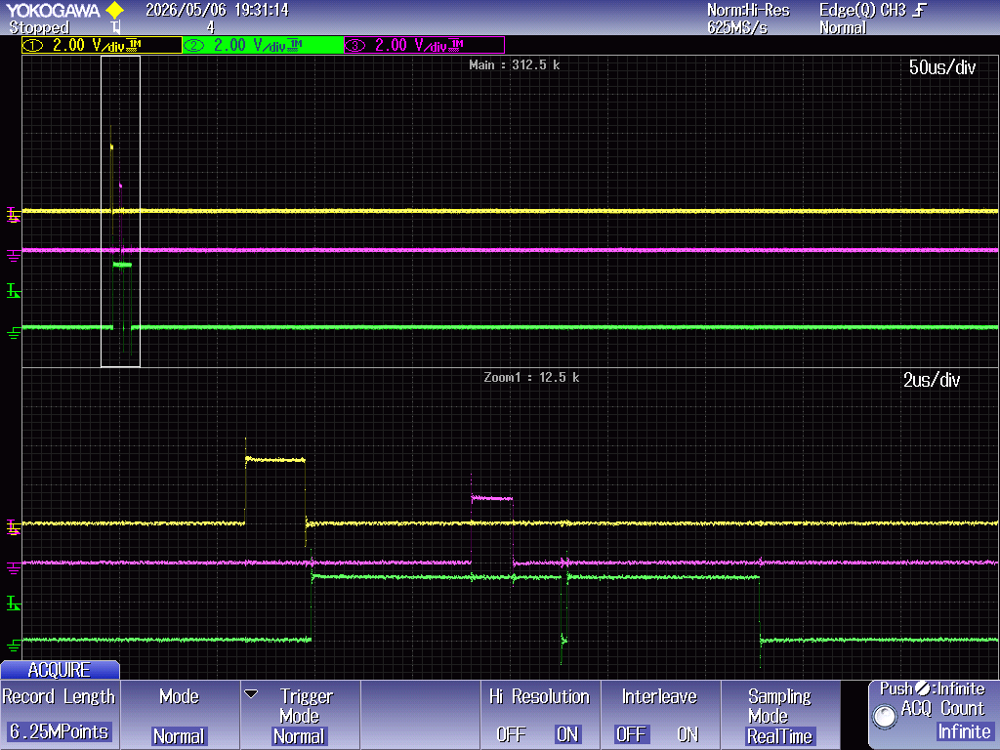

# ARK - Test Plan

## Purpose

This document defines the structure and strategy of the RTK validation test
application.

The test application is intended to:

- verify RTK requirements;
- provide evidence for the hazard analysis;
- produce repeatable PASS/FAIL results;
- exercise the validated RTK configuration on the selected STM32 target board.

## Test Application Location

The RTK test application is expected to live inside an existing STM32CubeIDE
project for the selected target board.

The STM32CubeIDE project is not moved into the ARK repository. The ARK
repository contains RTK sources and certification documentation; the board
project provides hardware initialization, linker script, startup code, and
device-specific integration.

The test report shall identify:

- STM32CubeIDE project name and location;
- target board;
- target MCU;
- ARK/RTK source commit;
- RTK configuration files used;
- test application revision.

## Architectural Separation

The test application shall separate board-specific initialization from RTK test
logic.

The intended split is:

- `main.c`: board-specific hardware initialization generated or maintained in
  STM32CubeIDE;
- `RTK_TestMain.cpp`: RTK test harness entry point, independent from board hardware
  except for abstract diagnostic services;
- `MainTask.cpp`: first RTK task, responsible for executing the test campaign;
- diagnostic and board adapter files: output, LEDs, GPIO pulses, and optional
  timing probes, RTK interrupt priority setup, and scheduler `BASEPRI`
  configuration.

`RTK_TestMain.cpp` and `MainTask.cpp` shall not include STM32 HAL headers directly.
They shall use a small test support API for diagnostic output and board
observability.

## Entry Point

The board `main.c` shall perform only hardware-level initialization and then
call the RTK test harness entry point.

The interface between C startup code and the C++ test harness shall be:

```c
#ifdef __cplusplus
extern "C" {
#endif

void RTK_TestMain(void);

#ifdef __cplusplus
}
#endif
```

Typical `main.c` flow:

```c
int main(void)
{
    HAL_Init();
    SystemClock_Config();

    MX_GPIO_Init();
    MX_USARTx_UART_Init();

    RTK_TestMain();

    while (1) {
    }
}
```

Hardware initialization remains board-specific and outside RTK validation logic.

## `RTK_TestMain.cpp`

`RTK_TestMain.cpp` shall contain the RTK test harness startup function.

Responsibilities:

- initialize the abstract diagnostic backend;
- initialize the RTK heap using `minit()` or the selected heap initializer;
- verify that `SchedulerStart()` fails before scheduler initialization;
- initialize the scheduler using the validated scheduler parameters;
- create the initial RTK test task;
- start RTK with `SchedulerStart()`;
- report unexpected `SchedulerStart()` failure after valid initialization.

Example structure:

```cpp
extern "C" void RTK_TestMain(void)
{
    RTK_TestDiagInit();

    minit();

    if(SchedulerStart()) {
        RTK_TestFatal("SchedulerStart unexpectedly succeeded before SchedulerInit");
    }

    SchedulerInit(IdleTask, 10, 5, 20, 10);

    CreateNamedTask(MainTask, RTK_Pack("MAIN TEST   "),
                    MAIN_TASK_STACK, TaskPriorityMedium);

    if(!SchedulerStart()) {
        RTK_TestFatal("SchedulerStart failed");
    }
}
```

The actual parameter values shall match the validated configuration and shall be
reported in the test report.

## `MainTask.cpp`

`MainTask.cpp` shall contain the first RTK task executed by the scheduler.

Responsibilities:

- start the test campaign;
- execute or dispatch test groups;
- create auxiliary tasks when required by a test;
- collect PASS/FAIL results;
- produce a final summary;
- enter a controlled final state.

Example structure:

```cpp
extern "C" void MainTask(void)
{
    RTK_TestLog("RTK test campaign start");

    RTK_RunSchedulerTests();
    RTK_RunWaitTests();
    RTK_RunSemaphoreTests();
    RTK_RunTimerTests();
    RTK_RunMemoryTests();

    RTK_TestSummary();

    WaitForever();
}
```

`MainTask.cpp` shall remain independent from board-specific headers.

## Diagnostic Abstraction

The test application shall expose a small diagnostic API used by all test code.

Minimum API:

```cpp
void RTK_TestDiagInit(void);
void RTK_TestLog(const char *message);
void RTK_TestPrintf(const char *format, ...);
void RTK_TestPass(const char *test_id);
void RTK_TestFail(const char *test_id, const char *reason);
void RTK_TestFatal(const char *reason);
void RTK_TestSummary(void);
```

The diagnostic backend may use one of the following outputs:

- UART serial terminal;
- debugger terminal or SWO/ITM;
- TCP/IP logging;
- memory buffer read through debugger.

The selected backend shall be reported in the test report.

## Board Adapter

Board-specific functions shall be isolated in a board adapter.

Minimum API:

```cpp
void RTK_TestBoardInit(void);
void RTK_TestLedSet(unsigned id, bool on);
void RTK_TestLedToggle(unsigned id);
void RTK_TestPulseSet(unsigned id, bool on);
void RTK_TestPulseToggle(unsigned id);
DWORD RTK_TestTimestamp(void);
```

The board adapter is the only test layer allowed to include STM32 HAL headers or
board-specific pin names.

GPIO pulses should be used for timing-sensitive tests where textual logging
would perturb the behavior under observation.

## Test Groups

The initial test campaign shall be divided into the following groups:

- scheduler and task management;
- PendSV and context switch behavior;
- time-based waits and timeout behavior;
- wait conditions on flags, bits, queues, and semaphores;
- binary semaphores;
- counting semaphores;
- ordered timers and timer-list consistency;
- memory manager;
- diagnostics;
- configuration capture.

Each test case shall have a stable ID and shall be traceable to one or more
requirements and hazards.

The test firmware also includes an interactive console/stress phase. This phase
is currently present as operator-driven evidence and is being expanded. Until
its procedure, acceptance criteria, and PASS/FAIL reporting are finalized, it is
not assigned a stable test ID and is not counted as a separate traceability test
case.

## Medium/Low Priority Inversion Ratio Test

The test application shall include a dedicated automated test for the scheduler
medium/low priority inversion policy.

Purpose:

- create one medium-priority task and one low-priority task executing the same
  counter loop;
- keep both tasks ready for a fixed time interval;
- verify that the ratio between the medium and low counters is compatible with
  the configured `RTK_TEST_MEDIUM_FOR_LOW` value;
- report the result as `RTK-TC-SCHED-012`.

## PendSV Re-Pend Test

The test application shall include a dedicated test for
`RTK-REQ-SCHED-004`.

Purpose:

- verify that a scheduling request raised by an ISR while `PendSV_Handler` is
  active remains pending;
- verify that the pending PendSV is serviced immediately after the current
  PendSV exits;
- verify that the system does not wait for the next SysTick before servicing the
  new scheduling request.

Suggested observability:

- GPIO pulse at PendSV entry and exit;
- GPIO pulse in the ISR that calls `SCHEDULE`;
- PendSV entry counter stored in RAM;
- optional SWO/UART log after the timing-critical section has completed.

The test shall avoid textual logging inside the timing-critical ISR/PendSV
sequence.

The asynchronous timer used to request scheduling during PendSV shall remain
disabled during the automated functional test campaign. After all automated
scheduler cycles have completed, the test application shall print an operator
message, start a final RTK cycle dedicated to oscilloscope evidence, enable the
asynchronous timer, and remain in that evidence mode. The operator shall verify
on the oscilloscope that a timer pulse occurring inside `PendSV_Handler` is
followed immediately by another PendSV pulse.

Captured evidence:

{#fig:RTK-TC-SCHED-008-PendSV-repend width=100%}

## Locked Terminate PendSV Recovery Test

The test application shall include a dedicated test for `RTK-REQ-SCHED-003`.

Purpose:

- verify that a task can terminate after masking PendSV through
  `RTK_SchedulerLock()`;
- verify that `Terminate()` re-enables the scheduling interrupt path before
  requesting PendSV;
- verify that the terminated task descriptor is released and the heap returns to
  the pre-test state;
- verify explicit reporting of `RTK-TC-SCHED-011`.

Suggested sequence:

1. Capture heap status before creating the test task.
2. Create a high-priority task dedicated to the test.
3. In the test task, call `RTK_SchedulerLock()` and then return from the task
   function, forcing entry into `Terminate()`.
4. The parent task calls `SCHEDULE` and shall regain execution after the test
   task is destroyed.
5. Capture heap status after scheduling resumes.
6. Pass `RTK-TC-SCHED-011` if the test task ran once, the scheduler resumed, and
   heap status matches the pre-test snapshot.

## Scheduler Restart and Heap Stability Test

The test application shall include a dedicated test for
`RTK-REQ-SCHED-005`.

Purpose:

- verify that `SchedulerStart()` returns normally when all non-idle tasks have
  been destroyed;
- verify that the scheduler can be initialized and started repeatedly;
- verify that `SchedulerStart()` can restart after a previous normal return
  both with and without a repeated `SchedulerInit()` call;
- verify explicit reporting of `RTK-TC-SCHED-009` after a completed restart
  without repeating `SchedulerInit()`;
- verify that repeated scheduler start/stop cycles do not progressively consume
  heap memory;
- verify that stale timers, task descriptors, or scheduler lists do not affect
  the following cycle.

Suggested sequence:

1. Initialize the heap once at the beginning of the campaign.
2. Capture the initial heap status.
3. Repeat the scheduler cycle for a defined number of iterations.
4. In each iteration:
   - call `SchedulerInit()` on alternating iterations;
   - create the initial test task;
   - call `SchedulerStart()`;
   - let all non-idle tasks terminate;
   - capture heap status after scheduler return.
5. Compare heap status after each iteration with the expected baseline.
6. Report `RTK-TC-SCHED-009` after at least one completed restart that follows
   a previous scheduler cycle without repeating `SchedulerInit()`.

## Scheduler Start Without Initialization Test

The test application shall include a dedicated test for `RTK-REQ-SCHED-006`.

Purpose:

- verify that `SchedulerStart()` returns `false` when called before `SchedulerInit()`;
- verify that the rejected start does not start SysTick/PendSV scheduling;
- verify that the rejected start does not require cleanup by the caller.

Suggested sequence:

1. Initialize the heap and diagnostic backend.
2. Before calling `SchedulerInit()`, call `SchedulerStart()`.
3. Pass `RTK-TC-SCHED-010` if the return value is `false`.
4. Fail `RTK-TC-SCHED-010` if the return value is `true` or if scheduler execution starts.

The test should use `HeapStatus()` or equivalent memory-manager diagnostics to
record:

- heap size;
- maximum allocable block;
- number of free blocks;
- number of allocated blocks;
- memory-manager status code.

## Timer List Consistency Test

The test application shall include timer-list functional and consistency
coverage for `RTK-REQ-TIMER-001` and the timer-related part of
`RTK-REQ-DIAG-002`.

Purpose:

- verify that `SetTimer()` inserts active timers in expiration order;
- verify that timers with the same expiration remain represented in the active
  timer list;
- verify that `DisarmaTimer()` removes a pending timer and marks it elapsed;
- verify that `TimerTic()` marks expired timers elapsed after the expected wait;
- verify at campaign end that `CheckTimerStatus()` reports `TimerQueOk`;
- verify that `NumberOfActiveTimers` at the end of the `MainTask` test cycle is
  equal to the value captured before the test cycle begins.

Suggested sequence:

1. Run the timer functional group through `RTK_RunTimerTests()`.
2. Report ordered timer behavior as `RTK-TC-TIMER-001`.
3. Capture `NumberOfActiveTimers` before creating the auxiliary LED task and
   before dispatching the test groups.
4. After all test groups complete and the auxiliary task is killed, call
   `CheckTimerStatus()`.
5. Enter terminal failure if `CheckTimerStatus()` reports
   `TimerNumberError`, `TimerSequenceError`, or `TimerExpiredInQue`.
6. Compare the final active timer count with the initial count.
7. Treat absence of a timer fatal error before `MainTask` exits as
   `RTK-TC-TIMER-002` evidence.

Failure reporting:

- `TimerNumberError` shall indicate an active timer counter incongruence;
- `TimerSequenceError` shall indicate an expiration-order incongruence;
- `TimerExpiredInQue` shall indicate a timer marked elapsed while still linked
  in the active timer list;
- a changed active timer count shall indicate a timer leak or unexpected timer
  removal across the test cycle.

The accepted result shall be defined by the validated memory-manager strategy.
At minimum, the number of allocated blocks shall not grow monotonically across
iterations, and the maximum allocable block shall not degrade beyond the
accepted fragmentation threshold.

## Result Format

Each test shall produce a result in the following logical format:

```text
TEST <test-id> START
TEST <test-id> PASS
```

or:

```text
TEST <test-id> START
TEST <test-id> FAIL <reason>
```

The final campaign summary shall include:

- total number of tests;
- number of passed tests;
- number of failed tests;
- number of skipped tests;
- validated RTK configuration identifier;
- source commit.

## Open Items

- Confirm and record the selected STM32 validation board and the exact
  STM32CubeIDE test project location in the test report.
- Record the diagnostic backend and the GPIO/LED mapping used by the selected
  board adapter.
- Add explicit operator confirmation or recorded evidence for
  `RTK-TC-SCHED-008`, based on oscilloscope observation of the PendSV re-pend
  timing.
- Complete diagnostic test cases `RTK-TC-DIAG-001`, `RTK-TC-DIAG-002`, and
  `RTK-TC-DIAG-003`.
- Complete validated-configuration test case `RTK-TC-CFG-001`.
- Align emitted test log IDs to the full `RTK-TC-...` format.
- Add an explicit `TIMER-002` PASS/FAIL summary entry if campaign-level timer
  consistency shall be counted as a normal test-row result instead of a fatal
  acceptance guard.
- Review final requirement/hazard/test traceability after diagnostic and
  configuration tests are completed.
