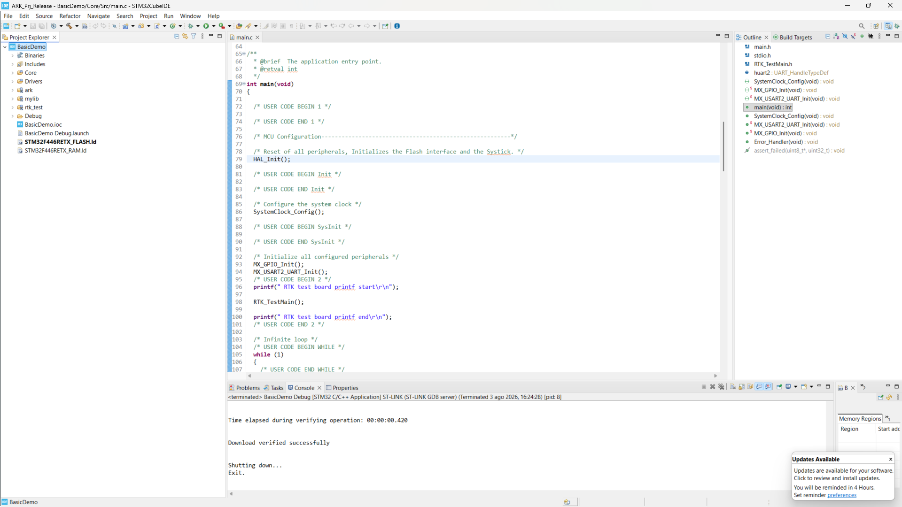
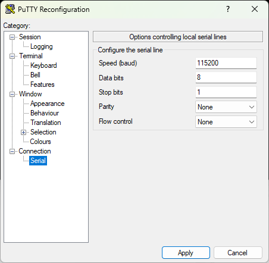
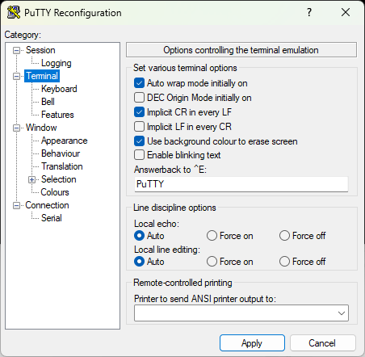
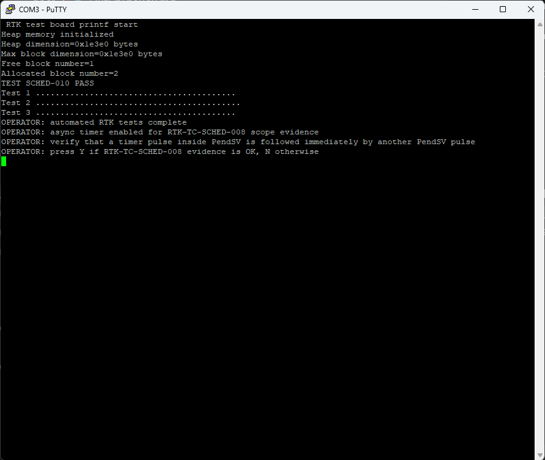
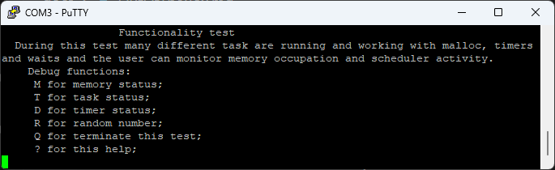
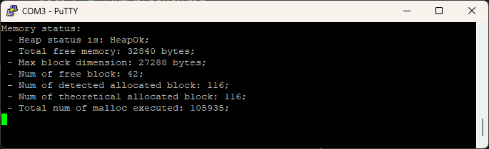
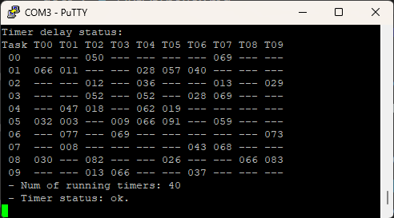
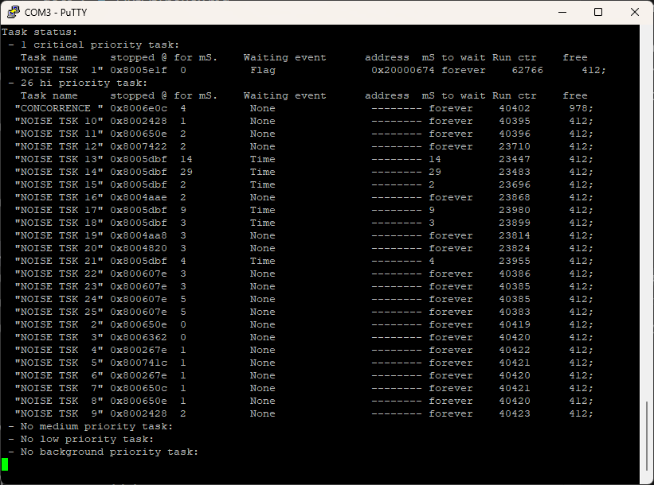

# Out of the Box

As a consequence of its deliberate simplicity, this RTK is a good starting
point for anyone wishing to approach the embedded world from the ground up.
For this reason, it is useful to explain how to get started using readily
available, inexpensive tools.

Although the RTK can be used on many different processors, it is supplied
preconfigured for initial use on an ST NUCLEO-F446RE evaluation board. Besides
being inexpensive, this board supports various Arduino-compatible expansion
boards and provides a powerful debugging interface compatible with SWI.

The port was developed using STM32CubeIDE, a free development environment
available from the ST website. It uses the standard GNU compiler, so once the
board is available, no additional purchases are required to start using the RTK.

To get started:

- Install a serial terminal emulator. This guide refers to PuTTY, but any
  suitable terminal emulator should work.
- Install the latest version of STM32CubeIDE.
- STM32CubeIDE normally installs the components required by ST-LINK. If the
  board is not detected as a debugger, or its virtual serial port does not
  appear, install the ST-LINK USB driver `STSW-LINK009` from the ST website,
  then disconnect and reconnect the board.
- Start STM32CubeIDE and install any requested updates.
- Download the project into a directory, referred to below as `ARK`.
- In STM32CubeIDE, select **File -> Open Projects from File System**.
- In the dialog, choose **Directory**, select the `ARK` directory, and press
  **Finish**.
- The `BasicDemo` project will appear in Project Explorer, normally in the
  left-hand column. Select `BasicDemo`, then choose **Project -> Build All**.
  The project should compile and link without errors, as shown in
  Figure \ref{fig:ImpPrj}.

{#fig:ImpPrj width=100%}

- Connect the development board through its USB interface. The PC will detect
  it as two separate devices: a debugging device and a serial interface.
- Open the terminal and configure it for the evaluation board serial port at
  115200 bit/s, 8 data bits, no parity, and one stop bit, as shown in
  Figure \ref{fig:ComConfig}. Enable automatic CR, as shown in
  Figure \ref{fig:TermConfig},
  so that a carriage return is added for each line feed.

{#fig:ComConfig width=100%}

{#fig:TermConfig width=100%}

- Select **Run -> Debug**.

## Running the tests

After entering debug mode, select **Run -> Resume** to start the test program.
The terminal will initially display a set of tests that run automatically, as
shown in Figure \ref{fig:TestStart}.

{#fig:TestStart width=100%}

For now, skip the requested verification and answer `y` to enter the test menu
shown in Figure \ref{fig:TestMenu}.

{#fig:TestMenu width=100%}

From this menu, several tests can be run. The memory test, shown in
Figure \ref{fig:TestMalloc}, provides information about `malloc()` operation
and heap management:

{#fig:TestMalloc width=100%}

The timer test shown in Figure \ref{fig:TestTimers} checks timer operation:

{#fig:TestTimers width=100%}

The current state of the available tasks can also be displayed, as shown in
Figure \ref{fig:TestTask}:

{#fig:TestTask width=100%}

At this point, the system is correctly configured and operational. The supplied
test program can be used as a starting point for understanding how the RTK
works.
